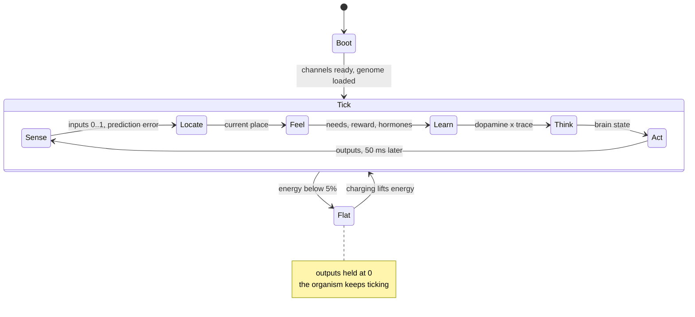

# Emergent

**[Overview](#overview) · [Build](#build) · [Body](#body) · [Algorithm](#algorithm) · [Memory](#memory) · [Evolution](#evolution) · [Simulator](#simulator) · [Hardware](#hardware-build) · [Status](#status-and-roadmap) · [Research](RESEARCH.md)**

> Built with the help of several AI systems: code, docs and design.

## Overview

A small robot on an ESP32 that should seem alive: it moves, explores, pokes at things,
answers sounds and lights, finds its own charger, leaves again when full, and never
gets stuck doing one thing. Every one of those behaviors is supposed to emerge.
None is written.

The rule is **write mechanisms, never behaviors.** The core program never mentions a
dock, a wall, a direction or what any channel means. Each tick it gets numbers in
and writes numbers out. It is told three facts about its body: which input is its
energy (the battery), which inputs hurt (a bumper), and which outputs run both ways.
Everything else has to come from a handful of animal-like traits: needs, curiosity,
a memory of places, hormones that set how bold it is, and one learning rule.
Evolution, run in a simulator, gives it the instincts to survive its first hour.
Learning, on the robot, adjusts them for the rest of its life.

The repo is three programs around one header:

| Path | What |
|---|---|
| [`src/organism.h`](src/organism.h) | the whole behavior program, header-only, identical on the ESP32 and in the simulator |
| [`src/esp32`](src/esp32) | robot firmware: channel drivers, board profiles, a 20 Hz loop around the organism |
| [`src/sim`](src/sim) | simulator: a modelled room, stations, batteries and bodies; evolves genomes |
| [`src/station`](src/station) | charging-station firmware: a state machine that beacons, blinks and clicks |

## Build

```sh
make -C src/sim test                          # unit tests for the organism
make -C src/sim                                # simulator
src/sim/emergent-sim --runs 8 --lives 3        # compare conditions on organism 0
src/sim/emergent-sim --evolve 40 --pop 32 --out genome.txt

pio run -d src/esp32 -e esp32dev -t upload     # robot (or -e esp32-s3-devkitc-1)
pio run -d src/station -t upload               # station
pio device monitor                             # 1 Hz: hunger, fullness, pain, boredom, dopamine, place
```

## Body

A robot is a list of channels from a fixed catalog. Inputs are read as 0..1; outputs
are −1..1 if bipolar, else 0..1. The organism sees channel *numbers*, never names.

| Inputs | Outputs |
|---|---|
| battery voltage (ADC through a divider) | DC motor (H-bridge: PWM + direction) |
| light (LDR on ADC) | stepper (STEP/DIR, velocity) |
| sound envelope (electret mic, RMS) | continuous-rotation servo (wheel) |
| touch (switch, or ESP32 touch pad) | positional servo (joint, head) |
| distance (Sharp IR on ADC, or ToF) | vibration motor (PWM) |
| shake and turn (MPU6050) | light (LED PWM or WS2812) |
| warmth (NTC on ADC) | sound (piezo tone) |
| station beacon strength (RSSI) | knock (solenoid pulse) |
| radio message (last ESP-NOW byte) | radio (one ESP-NOW byte) |
| charge current (INA219) | switch (relay, magnet, pump) |

**Supported in firmware today:** analog, digital and Wi-Fi-RSSI inputs; PWM,
H-bridge, digital and servo outputs. The rest are simulated and planned for M5 below.

A robot's configuration is a board profile, a C array under
[`src/esp32/include/boards/`](src/esp32/include/boards), selected by a PlatformIO
environment:

```cpp
static const SensorSpec kSensors[] = {
    // name              kind                       pin  rate_hz  ssid                hurts
    {"battery_voltage", SensorKind::kAdcNormalized, 34, 1.0f},
    {"touch_bump",      SensorKind::kDigitalIn,      4, 0.0f,    nullptr,            true},
    {"rf_rssi_station", SensorKind::kWifiRssi,       0, 0.2f,    "emergent-station"},
};
static const ActuatorSpec kActuators[] = {
    // name          kind                             pin aux  min    max   rate/s cost
    {"motor_left",  ActuatorKind::kPwmBidirectional, 25, 27, -1.0f, 1.0f, 4.0f, 1.0f},
    {"motor_right", ActuatorKind::kPwmBidirectional, 26, 14, -1.0f, 1.0f, 4.0f, 1.0f},
    {"head_pan",    ActuatorKind::kServo,            19,  0, -1.0f, 1.0f, 2.0f, 0.2f},
};
// ...plus .energy_sensor = "battery_voltage"
```

Adding a part means adding a catalog kind once (a `SensorKind`/`ActuatorKind` and
its read/drive code); after that any profile can use it.

## Algorithm

The robot's only coded states are booting, ticking, and holding still on a flat
battery. Everything else, like foraging, feeding, resting, exploring and fleeing,
is a pattern inside the tick, not a state anyone wrote.



[`organism.h`](src/organism.h), every 50 ms, inputs `x` in, outputs `u` out:

```text
sense   prediction error e = x − x̂ (x̂ from the forward model)
        surprise = error beyond each input's usual jitter
        progress = error over ~20 s minus error over ~2 s, if positive: it is learning
locate  place    = nearest remembered situation (senses minus energy, ~1 s smoothed)
feel    hunger   = buffered energy below its set-point
        fullness = buffered energy above its satiety point
        pain     = jolts on inputs that hurt, fading over ~10 s
        boredom  = rises while it learns nothing; relieved by progress and by arriving
                   somewhere unfamiliar, relative to the last half hour
        need     = hunger² + (fullness/2)² + pain² + boredom²      reward r = −Δneed
        dopamine   = r + γV' − V, normalized                (surprise in reward)
        adrenaline = recent surprise and pain                (seconds)
        cortisol   = need left unmet                         (minutes)
        serotonin  = contentment                             (minutes)
think   24 fixed random recurrent neurons, timescales 0.1–10 s, fed x and a copy of u
act     f = [x, needs, hormones, neurons, places, 1]
        u = tanh(W f) + σ·noise     (noise: Ornstein–Uhlenbeck, τ ≈ 1 s)
        σ = base × (0.3 + hunger + adrenaline + cortisol + boredom) × (1 − 0.7 serotonin)
learn   W += η (1 + adrenaline) · dopamine · trace(noise ⊗ f)     the only learning rule
        V += TD(0);   forward model += normalized LMS
```

Each trait, and the goal it is there for:

| Trait | Rule | For |
|---|---|---|
| Hunger | energy below a set-point is a need | feeding, finding the charger |
| Satiety | energy above a set-point is a milder need | not charging forever |
| Pain | a jolt on a `hurts` input is a need that fades | not bumping into things |
| Curiosity | boredom rises while nothing is being learned; relieved by *learning progress* and by arriving somewhere unfamiliar | exploring, poking things, ignoring noise |
| Squared needs | reward = total of squared needs going down | the worst need wins: task switching without a scheduler |
| Hormones | set exploration size and learning speed, never what to do | moods: bold, calm, restless, frightened |
| Brain | fixed random recurrent network fed its own outputs | rhythms, gaits, short-term memory |
| Learning | reward-prediction error × eligibility trace of what it tried | turning lucky accidents into habits |

How each goal is supposed to come out of these:

- **Move.** Smooth exploration noise wanders coherently; whatever relieves needs is
  reinforced. The brain gets a copy of its own outputs, so a crawler can find a gait.
  Nothing says which outputs are legs.
- **Explore, be curious.** Boredom widens exploration and its relief pays out as
  reward. Relief comes from the forward model *improving*, so a flickering lamp or its
  own motor hum goes stale, while something new it can learn stays interesting until
  it is learned (the "noisy TV" fix: Schmidhuber; Oudeyer & Kaplan).
- **Engage: push it, stop, see what it does.** Its own outputs feed the forward model
  through the brain, so the consequences of its own actions are the most learnable
  thing in its world. A movable object is progress; a wall is learned once.
- **Communicate.** Light, sound and radio are outputs like any other; mic, light and
  radio are inputs like any other. Its own beep is learned in minutes and goes stale.
  Something that *answers* is learnable but never trivially so, the most interesting
  thing a learning-progress agent can find.
- **Feed itself.** Hunger rises as the battery drains; the value estimate learns which
  senses and places come before relief, and dopamine turns the moves that led there
  into habits. Evolution supplies a rough instinct so a newborn doesn't starve first.
- **Leave when full; never stuck.** Every reward source habituates: satiety ends
  feeding, learned things stop relieving boredom, pain fades, cortisol widens
  exploration when a need stays unmet. None of this says "leave".
- **A spatial model.** See [places](#memory).

Grounding and prior work: [RESEARCH.md](RESEARCH.md).

## Memory

| Memory | Holds | Timescale | Survives reboot |
|---|---|---|---|
| Working | the brain's 24 neuron states (inputs, own outputs) | 0.1–10 s | no |
| Predictive | forward model `M` (features → next inputs), per-input error statistics | minutes | planned |
| Places | up to 12 remembered situations and how familiar each is | hours | planned |
| Value | `V`: how good the current features are | minutes–hours | planned |
| Habits | readout `W` | life | planned |
| Instinct | `W0` from evolution; learned weights relax toward it | fixed | flashed |

**Places** are a map without coordinates. There's no positioning sensor, so a place
is what the senses (minus energy) looked like there, smoothed over a second. The
nearest remembered one is where it is; one far from all of them becomes a new place,
evicting the least familiar. Familiarity is time spent there, fading over an hour.
Place activations are features like any other, so "this is where hunger gets
relieved" (value) and "turn left here" (readout) are learnable, and arriving somewhere
unfamiliar relieves boredom. Stepper odometry or a gyro would later let places carry
heading.

**Planned: two-speed habits and sleep (M2).** Today one weight matrix does
everything, and in simulation learning can erase a working solution and doesn't
accumulate across lives. The fix, after complementary learning systems:

```text
W = W_slow + W_fast
learning writes W_fast; W_fast decays toward 0 over ~10 min
sleep (docked, calm): W_slow += κ·W_fast if reward over the episode was positive; save to flash
W_slow relaxes weakly toward W0 (instinct)
```

Sleep also gives docking its look of rest, and a natural moment to persist state.

## Evolution

A newborn with blank weights starves: it either learns to rest or finds a cheap
self-stimulation. Animals avoid this by being born with instincts. So the outer loop,
run only in the simulator, evolves the **genome**: a dozen constitution numbers
(set-points, rates, timescales, brain seed) plus the innate readout `W0`.

- Population 32; best quarter kept; the rest are mutated children of tournament winners.
- Fitness: lifespan ÷ idle endurance, averaged over 2 newborns × 2 consecutive lives in
  randomized rooms and starts, so learning must keep an instinct good, not ruin it.
- World: two stations whose small buffers run dry and refill slowly, so camping on
  one dock loses.

The best genome is saved as a text file (`--out`) and run with `--genome`. Flashing
it to the robot is part of M5.

## Simulator

[`src/sim`](src/sim) runs the unmodified `organism.h` in a 3 × 2.5 m room:

| Part | Model |
|---|---|
| Stations | contacts behind a 45° V funnel on each side wall; 1 A CC/CV charge, tapering above 80%; LED lure; clicks while charging; a 0.3 Ah buffer each, refilling at 0.2 A |
| Battery | 3S LiPo 1 Ah, LiPo-shaped discharge, 0.15 Ω sag under load; 0.25 A base draw, 0.7 A per stepper at full speed |
| Drive | differential 0.2 m/s; walls clamp position and press the bumper |
| Light | inverse-square from the station LEDs and a window, cosine acceptance, LDR compression |
| RF | log-distance path loss, correlated shadowing, fast fading, 5 s scan (`--rssi-period`) |
| Mic, IR, gyro, warmth | own motors and buzzer, station clicks; Sharp IR 10–80 cm; yaw rate; charger warm, window cool |

Organism 0 is the [example build](#hardware-build). Organisms 1 and up are generated
from a seed out of real parts: stepper or DC wheels, a tricycle, one or two vibration
motors, or two servo legs that only push on the backward sweep. The organism isn't told
which.

**Conditions:** `full`; `no_learning` (born with its genome, never learns);
`no_battery_link`; `noise_only` (no instincts, no learning); `random_walk` (null
model). `--off satiety,progress,places` switches traits off for ablation.

**Columns:** lifespan, deaths, dockings, time docked, `full%` (docked time above 95%
charge: charging forever), coverage, speed, distance to the station hungry vs sated,
behavior entropy, meals at a different station than the last (`switches`), places
remembered. `--trace out.json` writes a 1 Hz trace that
[`viewer.html`](src/sim/viewer.html) plays back.

### Results

First M1 run. Two populations of organism 0 evolved for 40 generations in the
two-station world, one with the new traits (satiety, learning-progress curiosity,
places) and one without. Each genome was then tested on 8 unseen rooms × 4
consecutive lives, capped at 12 h:

| Genome, traits | Lifespan (h) | Died | Docked | Places | By life 1 → 4 |
|---|---|---|---|---|---|
| evolved without, off | **12.0 ± 0.0** | 0% | 58% | – | 12.0 12.0 12.0 12.0 |
| evolved without, switched on | 7.4 ± 5.0 | 50% | 37% | 4.5 | 8.6 8.0 6.3 6.6 |
| evolved with, on | 7.9 ± 5.4 | 38% | 60% | 7.0 | 12.0 5.0 6.5 8.0 |
| … satiety off | 9.5 ± 4.7 | 25% | 74% | 6.8 | 12.0 6.0 12.0 7.9 |
| … progress off | 6.8 ± 5.5 | 50% | 57% | 7.8 | 10.7 3.8 8.9 3.7 |
| … places off | 1.8 ± 1.1 | 100% | 49% | – | 2.2 1.7 2.2 1.4 |
| no instincts, no learning | 1.9 ± 0.2 | 100% | 2% | 11.2 | |
| random walk | 1.5 ± 0.2 | 100% | 37% | – | |

What this says:

- **Evolution works:** both evolved genomes outlive a random walk several times over.
- **The traits don't help survival here; they hurt it.** The genome evolved without
  them lives every life to the cap. It does so by camping: it stays within 5–13 cm of
  one station and never visits the other (0 station switches). The world
  doesn't punish camping enough, and survival is the only thing fitness rewards, so
  the most lifelike genome isn't the fittest one. Switching places off in the
  traits genome is fatal only because its instincts were evolved to use place
  features.
- `full%` (docked above 95% charge) read 0% everywhere: contacts chatter on and off,
  so charge never tops out. The metric needs replacing (time docked while not hungry).

Next for M1: a world where camping fails (station refill below idle draw, stations
that go dark), a liveliness term in fitness (coverage, station switches), and a
satiety test that doesn't depend on a full charge.

## Hardware build

The example build, and the simulator's organism 0: a two-wheeled stepper robot with a
panning head, light eyes, ears, bumper, IR distance, station RSSI and a battery it can
feel, on one ESP32 DevKit.

| Qty | Part | Role |
|---|---|---|
| 1 | ESP32-WROOM-32 DevKit | brain |
| 2 | NEMA17 stepper + A4988 or TMC2209 | wheels (TMC2209 is quiet: the mic hears less of itself) |
| 1 | SG90 servo | head pan |
| 2 | GL5528 LDR + 10 kΩ | eyes, on the head, ±35° |
| 1 | MAX4466 mic module | ears |
| 1 | Sharp GP2Y0A21 | distance ahead |
| 1 | microswitch + bumper plate | touch (`hurts`) |
| 1 | LED, passive piezo | light and sound it can make |
| 1 | 3S LiPo 1–2 Ah + 3S BMS; 5 V 3 A buck | energy |
| 1 | 100 k / 22 k divider + 100 nF | battery sense (the `energy` input) |
| 2 | wide copper pads | charge contacts |

| Channel | Pin | Notes |
|---|---|---|
| battery | GPIO 34 | 9.0–12.6 V pack → 1.62–2.27 V at the pin |
| mic | GPIO 35 | needs ~8 kHz background sampling for an envelope (M5) |
| light L / R | GPIO 32 / 33 | 3.3 V → LDR → pin → 10 k → GND |
| IR distance | GPIO 36 | 10 µF at the sensor |
| bump | GPIO 4 | 10 k pull-up |
| steppers L / R | STEP/DIR 25/26, 27/14; shared EN 13 | disable at rest: holding current drains the battery |
| head servo, LED, piezo | 18, 19, 23 | |

Keep analog inputs on ADC1 (GPIO 32–39): ADC2 is unusable with Wi-Fi on. Avoid GPIO
6–11 and the strapping pins 0/2/5/12/15. Charge only through a proper BMS with a
current-limited CC/CV supply.

**Station.** [`src/station`](src/station) only watches and signals; a real charger
module delivers the current. It senses contact voltage and current, derives idle /
charging / full, and signals each with an LED waveform, a click and a Wi-Fi beacon
(`emergent-station`, the SSID the robot's RSSI channel tracks). Mechanically: a V
funnel and shallow ramp guide the robot in; spring-loaded pogo pins meet wide pads on
the robot. Tune the thresholds in `include/tuning.h` against your pack.

## Status and roadmap

| | |
|---|---|
| Works in simulation | the organism and evolution (survives several times longer than a random walk); the new traits don't yet pay off, see [results](#results) |
| Firmware | runs the organism on the reference boards; built by CI on pull requests and `main`, **never run on hardware** |
| Hypothesis | that this looks alive on a real robot. Unverified |

Size budget: core ≤ 600 lines, firmware ≤ 800, simulator ≤ 1500, this README ≤ 10
pages. Each milestone is done when its criterion holds in the simulator (M6 on
hardware); a trait stays only if switching it off makes things measurably worse.

| # | Milestone | Done when |
|---|---|---|
| M0 | Prune to one core, one simulator, one firmware, two docs | CI green, sizes within budget |
| M1 | Satiety, curiosity as learning progress, places | each kept trait beats its ablation on lifespan or `full%` |
| M2 | Two-speed habits, sleep consolidation, state saved to flash | lifespan doesn't fall across 6 consecutive lives |
| M3 | Fatigue: recent effort per output is a need that rest relieves | rest/activity cycles; no output pattern held for minutes |
| M4 | A pushable object and a second organism in the simulator | more time with a movable object than a fixed one; information between one's outputs and the other's inputs (a null result is a result) |
| M5 | Catalog drivers: ESP-NOW beacon and byte, mic envelope, stepper, piezo, MPU6050, per-input ranges; genome and state in flash | builds in CI; runs on a bench board |
| M6 | Build the example robot and station | repeated sessions: docks when hungry, leaves when full |

Releases are tagged on [GitHub](https://github.com/sloev/emergent/releases).
License: [MIT](LICENSE).
