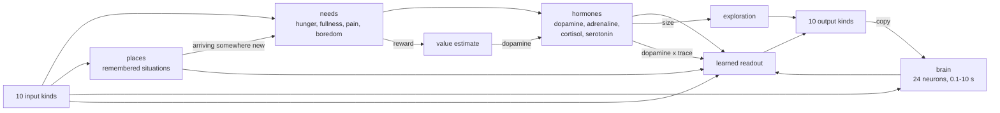

# Life: 10 Senses, 10 Outputs, One Small Program

[← Back to project overview](index.html)

The rule: **write mechanisms, never behaviors.** No line of the program mentions a
dock, a wall, a direction, a signal's meaning, or what any channel is for. Each tick
it gets numbers in and writes numbers out. It is told exactly two facts about its
body: which input is its energy (the battery) and which inputs hurt (e.g. a bumper).

Everything else it does has to come out of a handful of mechanisms: a brain, a model
that predicts its own senses, a memory of places, four needs, four hormones,
exploration, and one learning rule. [`traits.md`](traits.md) lists them as traits,
says which goal each is for, and what the simulator shows each is worth. What it's born with comes from **evolution**, not from anyone writing it. The program is
[`src/esp32/include/life/organism.h`](../src/esp32/include/life/organism.h), about 300
lines, header-only, identical on the ESP32 and in the [simulator](../src/sim/README.md).

## The 10 inputs

Every input is read as a number from 0 to 1. Kinds, not meanings: two light sensors
are two `light` inputs, and the program never learns their names.

| # | Kind | Part | How it's read | 0..1 means |
|---|---|---|---|---|
| 1 | **energy** | battery through a 100k/22k divider | ADC (GPIO 32–39) | empty…full pack voltage |
| 2 | **light** | GL5528 LDR + 10 kΩ | ADC | dark…bright |
| 3 | **sound** | MAX4466 electret mic | ADC, sampled ~8 kHz in the background, RMS | quiet…loud |
| 4 | **touch** | microswitch, or an ESP32 touch pad | GPIO / touch peripheral | untouched…pressed |
| 5 | **distance** | VL53L0X time-of-flight (I2C), or Sharp IR (ADC) | | far…near |
| 6 | **shake** | MPU6050 accelerometer magnitude (I2C) | | still…jolted |
| 7 | **turn** | MPU6050 gyro yaw rate (same chip) | | spinning one way…the other (0.5 = straight) |
| 8 | **warmth** | NTC thermistor + 10 kΩ | ADC | 15 °C…30 °C |
| 9 | **radio strength** | the ESP32's radio: RSSI of heard ESP-NOW packets | built in | −90…−30 dBm |
| 10 | **radio message** | the ESP32's radio: last byte heard over ESP-NOW | built in | byte / 255 |

The charging station broadcasts over ESP-NOW about 10 times a second, so radio
strength updates quickly (a Wi-Fi scan takes seconds). Its message byte is its state:
idle, charging, full. Another organism's broadcasts arrive on the same two inputs.

## The 10 outputs

Bipolar outputs run −1..1, the rest 0..1. Again kinds, not meanings: nothing says
two DC motors are "wheels".

| # | Kind | Part | Driven by | Range |
|---|---|---|---|---|
| 1 | **DC motor** | N20 gearmotor + DRV8833 | 2 PWM pins | −1..1 speed |
| 2 | **stepper** | NEMA17 or 28BYJ-48 + driver | STEP/DIR, RMT or FastAccelStepper | −1..1 speed |
| 3 | **wheel servo** | continuous-rotation servo | 50 Hz PWM | −1..1 speed |
| 4 | **servo** | SG90 / MG90S positional | 50 Hz PWM | −1..1 angle |
| 5 | **vibration** | coin / pager vibration motor | PWM via MOSFET | 0..1 |
| 6 | **light** | LED or WS2812 | PWM / RMT | 0..1 brightness |
| 7 | **sound** | passive piezo | PWM tone | 0..1 loudness |
| 8 | **knock** | 5 V solenoid tapper | MOSFET, pulse on rising edge | 0..1 |
| 9 | **radio** | the ESP32's radio: one ESP-NOW byte broadcast | built in | 0..1 → byte |
| 10 | **switch** | relay, electromagnet, pump | GPIO via MOSFET | off / on |

Locomotion is whichever outputs happen to move the body: two DC motors or
steppers or wheel servos as wheels, a stepper plus a steering servo, two servo legs,
one or two vibration motors. The program doesn't know which.

## The program

```text
every 50 ms:
  sense      surprise = how far inputs missed what its forward model predicted,
                        beyond each input's own usual residual jitter
             progress = how much those misses are shrinking (error over ~2 s below
                        error over ~20 s): it is learning something
  locate     place    = nearest remembered situation (senses minus energy, ~1 s smoothed);
                        one unlike any becomes a new place; familiarity = time spent there
  feel       hunger   = buffered energy ("blood sugar", ~30 s) below its set-point
             fullness = buffered energy above its satiety point
             pain     = jolts on inputs that hurt, fading over ~10 s
             boredom  = rises while it learns nothing, relieved by progress and by arriving
                        somewhere unfamiliar, relative to the last half hour
             need     = hunger² + (fullness/2)² + pain² + boredom²   reward = need going down
  hormones   dopamine   = reward - expected (TD error of a learned value estimate)
             adrenaline = recent surprise and pain          (seconds)
             cortisol   = need left unmet                   (minutes)
             serotonin  = contentment                       (minutes)
  think      24 recurrent neurons, random fixed wiring, timescales 0.1-10 s,
             driven by the inputs and a copy of its own outputs
  act        out = readout(inputs, needs, hormones, neurons, places) + exploration
             exploration size = base x (0.3 + hunger + adrenaline + cortisol + boredom) x (1 - 0.7 serotonin)
  learn      readout += rate x (1 + adrenaline) x dopamine x trace(exploration x feature)
             value   += TD(0)
             model   += normalized LMS toward what the inputs actually did
```



Why each piece is there, and where it comes from:

- **Forward model.** The organism learns to predict its own inputs, and only what it
  failed to predict is surprising. Without this, repetitive motion (a steady spin)
  stays "surprising" forever and becomes a self-stimulating stereotypy; with it,
  repetition turns boring.
- **Curiosity is learning progress, not surprise.** Boredom is relieved by the
  model's error *falling*, not by error itself. Random noise is surprising forever
  and teaches nothing, so it gets boring; a new thing it can learn (a wall that
  answers a push, its own buzzer in its mic, another robot that answers back) is
  interesting exactly while it is being learned (Schmidhuber 1991/2010; Oudeyer,
  Kaplan & Hafner 2007).
- **Places.** No coordinates: a place is a situation that looked different from every
  other it remembers. Place activations are features like any other, so the value
  estimate can learn which places are good when hungry and the readout what to do
  in each; arriving somewhere unfamiliar is itself interesting (count-based
  novelty).
- **Satiety.** Energy above a set-point is a mild need of its own ("too full"), so
  a full battery gives no reason to stay on the charger, and boredom there does the
  rest (alliesthesia: Cabanac 1971).
- **Brain.** A fixed random recurrent network holds recent history and produces
  rhythms. A learned readout of it can generate gaits and sequences without anyone
  writing an oscillator (reservoir computing; learned by reward modulation in Hoerzer,
  Legenstein & Maass 2014).
- **Needs as the only reward.** Homeostatic reinforcement learning: reward is the
  reduction of drive, squared so a big deficit dominates (Keramati & Gutkin 2014).
- **Hormones set how, never what.** Dopamine as the reward prediction error; the other
  three as the knobs of learning and exploration (Doya 2002, *Metalearning and
  neuromodulation*). What an observer calls fear, contentment, restlessness or
  excitement are patterns across these, not states anyone wrote.
- **One learning rule.** Three-factor: a trace of exploration × activity, gated by
  dopamine. It's the rule the eligibility-trace literature attributes to dopamine
  plasticity, and it's the only one in the program.
- **Genome.** A dozen numbers (brain wiring seed, hunger and satiety set-points, place size, boredom rate,
  pain fade, energy buffer, exploration size and smoothness, learning rates, value
  horizon, trace length, brain gain) plus the **innate readout weights** it is born
  with. Two organisms with the same body and different genomes behave differently for
  life.

## Evolution

A newborn with blank weights, rare food and movement that always costs energy does one
of two things in simulation: learns to rest (and starves) or finds a cheap
self-stimulation (and starves faster). Better reward formulas only move it between
those failures. Animals avoid this by not being born blank: evolution gives them
innate reflexes, and learning refines them.

So the last mechanism is an outer loop, run in simulation: a population of genomes,
each born into the room (different rooms and start positions every generation), scored
on self-sufficiency, the best quarter kept, the rest replaced by mutated children of
tournament winners. Nothing in it names a behavior. It only keeps what stayed alive.
The evolved genome (constitution + innate weights) is what gets flashed; learning then
continues on the robot.

```sh
./emergent-sim --evolve 40 --pop 32 --out genome.txt   # evolve for organism 0's body
./emergent-sim --genome genome.txt --runs 8 --lives 3  # test it on unseen rooms
```

## What should emerge, and how we'd know

Each claim below is falsifiable in the simulator first, then on hardware.

| Should emerge | From | Measured as |
|---|---|---|
| Moving at all | exploration + readout | coverage above zero, not jitter |
| Feeding (docking when hungry) | dopamine from hunger relief | self-sufficiency > 1 (lifespan ÷ idle endurance) |
| Leaving when full, returning when hungry | satiety + hunger as features | distance to the station hungry vs sated; % of docked time spent full |
| Exploring, then settling | learning progress + place novelty | places remembered; coverage |
| Avoiding what hurts | pain relief | bumps per hour falling over a life |
| Rest and activity cycles | serotonin vs boredom | alternating low/high movement periods |
| Gaits (crawlers, legs) | brain rhythms + readout | net displacement with servo legs |
| Individual temperament | genome | same body, different genome, different behavior |
| Moods | hormone patterns | hormone traces vs behavior; observer ratings on video |
| Signaling | radio/light/sound outputs + another organism | mutual information between one's output and the other's state |

Signaling is the least likely: it only stabilizes when sender and receiver both gain
(Lewis signaling games; Lowe et al. 2019). A null result there is a real result.

## What's measured so far

See the [simulator README](../src/sim/README.md).
