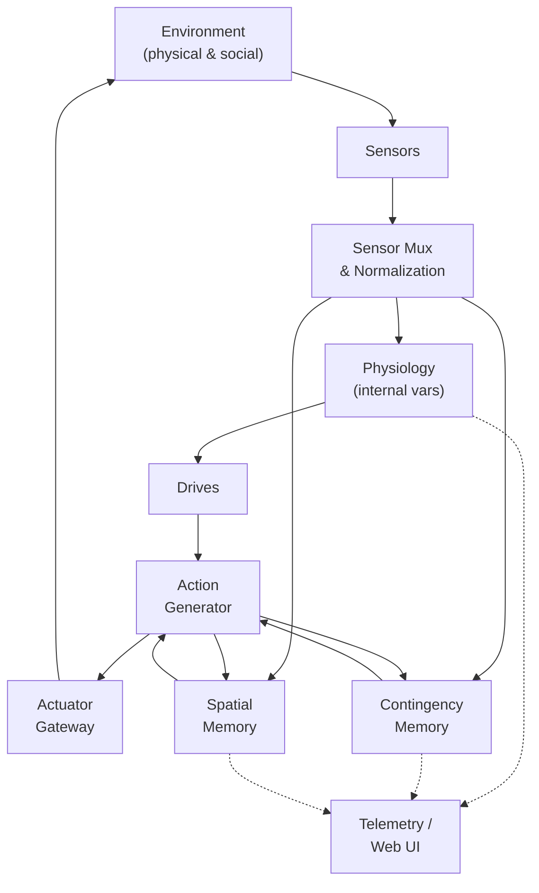
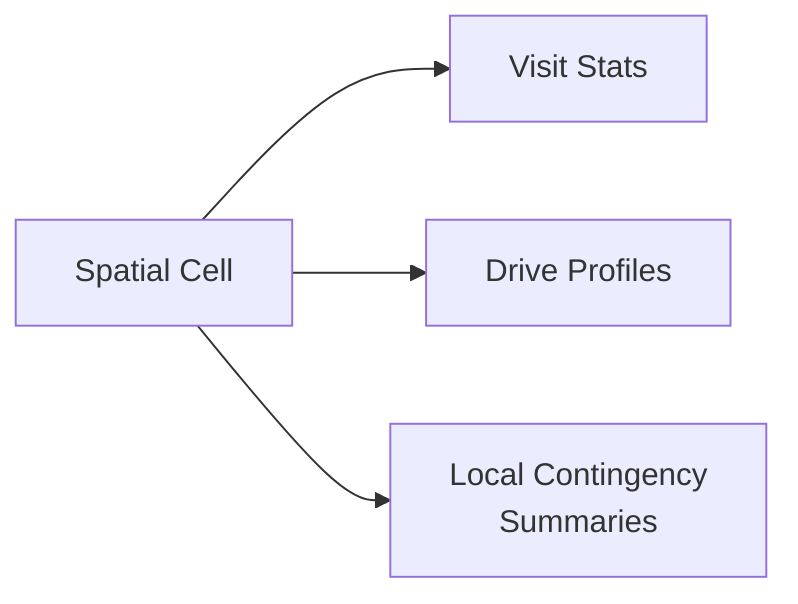
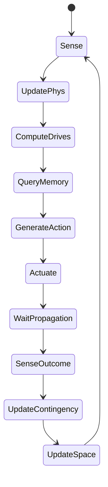
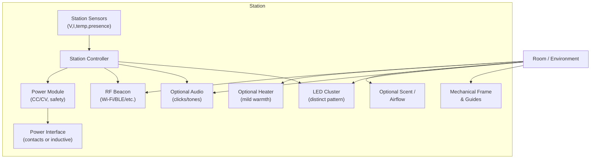
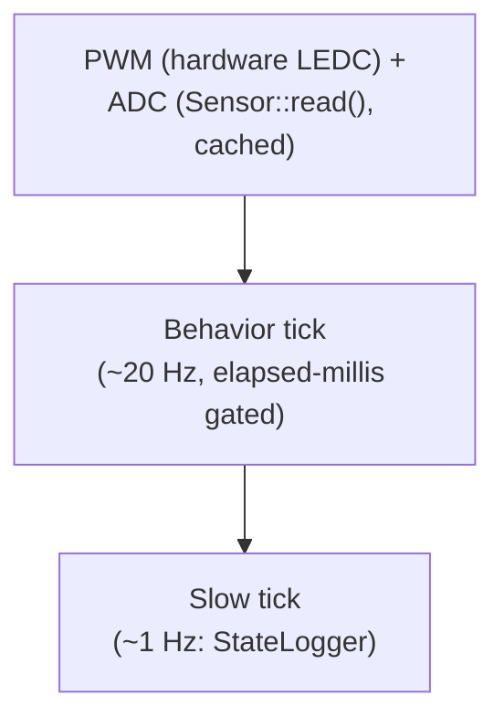

# Emergent: A Synthetic Ethology Platform for ESP32-Class Hardware

[← Back to project overview](index.html)

## Table of Contents

- 1\. [Introduction](#1-introduction)
- 3\. [Project Overview and Design Goals](#3-project-overview-and-design-goals)
- 4\. [System Architecture](#4-system-architecture)
   1. [System Overview Diagram](#41-system-overview-diagram)  
   2. [Layers and Responsibilities](#42-layers-and-responsibilities)  
- 5\. [The Body: Sensors and Actuators](#5-the-body-sensors-and-actuators)
   1. [Actuators](#51-actuators)  
   2. [Sensors](#52-sensors)  
   3. [Body Schema as an Emergent Construct](#53-body-schema-as-an-emergent-construct)  
- 6\. [Internal Physiology and Drives](#6-internal-physiology-and-drives)
   1. [Variables and Dynamics](#61-variables-and-dynamics)  
   2. [Drive Modulation Algorithm](#62-drive-modulation-algorithm)  
- 7\. [Contingency Memory](#7-contingency-memory)
   1. [Data Structure](#71-data-structure)  
   2. [Update Algorithm](#72-update-algorithm)  
   3. [No Privileged Semantics](#73-no-privileged-semantics)  
- 8\. [Spatial Memory and Navigation](#8-spatial-memory-and-navigation)
   1. [Spatial Representation](#81-spatial-representation)  
   2. [Action Biasing from Space](#82-action-biasing-from-space)  
- 9\. [Core Loop](#9-core-loop)
   1. [Behavior Flow Diagram](#91-behavior-flow-diagram)  
   2. [Core Loop Pseudocode](#92-core-loop-pseudocode)  
- 10\. [Input/Output Modalities and Emergent Uses](#10-inputoutput-modalities-and-emergent-uses)
    1. [Light and Phototaxis-Like Behavior](#101-light-and-phototaxis-like-behavior)  
    2. [RF Fields as Digital Gradients](#102-rf-fields-as-digital-gradients)  
    3. [Chemosensation and Scent Trails](#103-chemosensation-and-scent-trails)  
    4. [Touch and Collision](#104-touch-and-collision)  
    5. [Acoustic and Vibrational Coupling](#105-acoustic-and-vibrational-coupling)  
    6. [Battery as “Just Another Input”, Coupled to Energy](#106-battery-as-just-another-input-coupled-to-energy)  
- 11\. [Charging Station as an Emergent Attractor](#11-charging-station-as-an-emergent-attractor)
- 13\. [Life-State Persistence and Body Transfer](#13-life-state-persistence-and-body-transfer)
- 14\. [Implementation on ESP32-Class Hardware](#14-implementation-on-esp32-class-hardware)
    1. [Software Structure](#141-software-structure)  
    2. [Memory and Timing Constraints](#142-memory-and-timing-constraints)  
- 15\. [Experimental Program and Ablations](#15-experimental-program-and-ablations)

History, prior art, "personality"/social speculation, and philosophical
framing that used to live in this document — as sections 2, 12, 16, 17, 18 —
have moved to [research.md](research.md), a separate, explicitly-not-the-spec
document, per [issue #2](https://github.com/sloev/emergent/issues/2): this
document should be a short, falsifiable description of working code, not a
6,000-word essay in the critical path. Numbering below keeps each remaining
section's original number rather than renumbering the whole document.

---

## Status

| Layer | Fact |
|---|---|
| Implemented | 20 Hz loop: sense → physiology → drives → memory → action → actuate → learn. Named-channel body. SoftAP dashboard. Life-state JSON. Station firmware as a separate state machine. |
| Tested | Host-native tests for bit packing, age saturation, rate-limit clamp, LEDC cap, and organism behavior (energy dynamics, contingency bias) against a fake body. Not real hardware. |
| Hardware tested | Nothing. No board has run this. |
| Designed / planned | Approach-and-dock, ablations, extra boards. |
| Hypothesis | That drives + decaying memory + noise will look alive, including charging as an attractor. Unverified. |

---

## 1. Introduction

The problem is simple to state and hard to do well: **make a small, cheap, battery-powered machine look alive**.

Not intelligent in the large-model sense, not conversational, and not necessarily useful for a fixed task. Instead, we want a machine that appears to have:

- internal variables that drift over time,  
- competing needs and priorities,  
- a body that constrains what it can do,  
- an environment that pushes back,  
- a history and imperfect memory,  
- consequences that follow from its actions,  
- changing preferences and habits,  
- periods of activity and rest,  
- enough stochasticity that its future is not trivially predictable.

Humans are extremely sensitive to motion, timing, and contingency. A few sensors, motors, delays, and feedback loops are enough for us to describe behavior using words like *curious*, *cautious*, *bored*, or *interested*. Heider and Simmel’s classic experiment showed that people attribute agency and intent even to moving geometric shapes.

In this project, such words are **observer-level summaries** of dynamics, not claims about subjective experience. The concrete engineering goal is:

> Construct a machine whose behavior is best understood in terms of internal regulation, learning, and interaction with its environment, rather than in terms of fixed scripts.

The central constraints are deliberate:

- **No large neural network.**  
- **No cloud inference.**  
- **No hand-authored behavior tree.**

Instead, we rely on:

- a structured description of the **body** (sensors and actuators),  
- a small vector of **physiological variables and drives**,  
- a compact, decaying **contingency memory** of action→sensation relationships,  
- a stochastic **action generator** modulated by drives and history,  
- a coarse **spatial memory**,  
- an optional **metabolic subsystem** that ties behavior to energy.

The remainder of this document presents the system architecture, algorithms, and experimental considerations for this synthetic ethology platform. Theory, prior art, and philosophical framing live separately in [research.md](research.md).

---

## 3. Project Overview and Design Goals

We aim for an architecture that:

1. **Runs on an ESP32-class microcontroller.**  
   - No external GPU or host PC.  
   - All learning and control are on-device.

2. **Treats signals symmetrically.**  
   - No hard-coded semantics for collision, battery, light, sound, RF, etc.  
   - Raw sensor channels are numbers; meaning is emergent.

3. **Implements a minimal “organism” architecture.**  
   - A small set of internal variables (“physiology”).  
   - Drives derived from deviations from target bands.  
   - A lossy, decaying contingency memory relating recent actions to subsequent sensory changes.  
   - A coarse spatial memory.  
   - A stochastic action generator modulated by drives and memories.

4. **Connects behavior to energy without scripting it.**  
   - Battery is just another input, albeit coupled numerically into `h_energy`.  
   - A charging station is a physical object with particular sensory profiles and power dynamics, not a symbolic goal.

5. **Supports serializable “life states”.**  
   - The organism can be paused, serialized, and restored into a different body.

6. **Is suitable as a research/education platform.**  
   - Easy to instrument and log.  
   - Easy to ablate components for experiments.

---

## 4. System Architecture

### 4.1 System Overview Diagram



This diagram uses simple node IDs, HTML `<br/>` for multi-line labels, and only ASCII characters to avoid Mermaid parsing issues.

### 4.2 Layers and Responsibilities

- **Body layer**  
  - Abstracts hardware into typed input/output channels.  
  - Encodes only physical constraints: ranges, update rates, safety limits.

- **Core loop**  
  - Maintains physiology and drives.  
  - Tracks contingencies between action deltas and sensor deltas.  
  - Maintains a coarse spatial map.  
  - Generates new actions from baseline + noise + memory-derived bias.

- **Observation layer**  
  - Streams internals for analysis and visualization.  
  - Allows downloading/restoring organism state.

---

## 5. The Body: Sensors and Actuators

### 5.1 Actuators

Actuators are generic effectors. The system does not know what they “mean”.

Example actuator set:

| Name                 | Type       | Range    | Physical Example                          |
|----------------------|------------|----------|-------------------------------------------|
| `motor_left/right`   | continuous | -1 … +1  | Differential drive motors                 |
| `servo_pan/tilt`     | continuous | -1 … +1  | Head or sensor orientation                |
| `vibe_motor`         | continuous | 0 … 1    | Vibration motor                           |
| `grind_motor`        | continuous | 0 … 1    | Noisy mechanical actuator (“voice”)       |
| `led_r/g/b`          | continuous | 0 … 1    | RGB lighting / signaling                  |
| `fan`                | continuous | 0 … 1    | Airflow actuator                          |
| `pump/atomizer`      | continuous | 0 … 1    | Fluid or scent emission                   |
| `heater`             | continuous | 0 … 1    | Local thermal field                       |
| `electromagnet`      | continuous | 0 … 1    | Gripping, field perturbation              |

Each actuator has:

- range and rate limits,  
- a cost estimate (used in physiology updates),  
- safety envelopes (e.g., thermal limits).

### 5.2 Sensors

Sensors provide normalized numeric streams. No label is privileged.

Example sensors:

| Name                          | Type        | Example Hardware                         |
|-------------------------------|-------------|------------------------------------------|
| `mic_energy`, bands, peaks   | continuous  | MEMS microphone                          |
| `distance_*`                  | continuous  | ToF, ultrasonic, IR                      |
| `touch_*`                     | cont/binary | Bump switches, capacitive strips         |
| `light_*`, `uv`              | continuous  | Photodiodes, light sensors               |
| `imu_accel/gyro/mag`         | continuous  | 6-axis or 9-axis IMU                     |
| `temperature`, `humidity`    | continuous  | Environmental sensors                    |
| `gas`, `air_quality`         | continuous  | Metal-oxide gas sensor                   |
| `rf_rssi_*`                  | continuous  | Wi-Fi/BLE RSSI or beacons                |
| `battery_voltage`, `current` | continuous  | ADC monitoring of power rails            |
| `internal_temp`              | continuous  | MCU or board temperature                 |

Battery signals enter at this layer as raw numbers, like any other sensor.

### 5.3 Body Schema as an Emergent Construct

We do **not** predefine kinematics or a body model. Instead, the system gradually learns regularities such as:

- “When `motor_left` and `motor_right` change like this, IMU and `distance_front` change like that.”  
- “When `servo_pan` increases, a particular light sensor often saturates.”

This echoes how infants learn their own bodies through co-occurrence of actuation, proprioception, and exteroception.

---

## 6. Internal Physiology and Drives

### 6.1 Variables and Dynamics

The internal state contains a small vector of slow variables, for example:

- `h_energy` — abstract “resource” level. It is **numerically coupled** to battery readings and actuator costs, but never treated as “battery percentage” symbolically.  
- `h_fatigue` — accumulated exertion.  
- `h_safety` — recent history of collisions, extreme temperatures, etc.  
- `h_arousal` — global activity or responsiveness.  
- `h_curiosity` — based on novelty or prediction error.  
- `h_boredom` — time spent in low-change regimes.

A social variable (history of correlated signals from other robots/humans)
was considered but isn't implemented: it would need a "presence of another
agent" sensor no current board has, and an unimplemented drive that never
moves is worse than no drive at all. See [research notes](research.md) for
the idea.

Each variable:

- integrates selected sensor channels,  
- decays or recovers over time,  
- may be coupled (e.g., high exertion drains `h_energy` and raises `h_fatigue`).

Drives are scalar pressures derived from deviations from preferred bands:

```text
drive[name] = deviation(h_name, target_range[name])
```

### 6.2 Drive Modulation Algorithm

Drives shape the scale and direction of stochastic exploration.

```python
def compute_drives(phys, targets):
    drives = {}
    for name, value in phys.items():
        lo, hi = targets[name]
        if value < lo:
            drives[name] = (lo - value) / (hi - lo + 1e-6)
        elif value > hi:
            drives[name] = (value - hi) / (hi - lo + 1e-6)
        else:
            drives[name] = 0.0
    return drives

def calculate_fuzz_scale(drives):
    curiosity = drives.get("h_curiosity", 0.0)
    boredom   = drives.get("h_boredom", 0.0)
    energy    = drives.get("h_energy", 0.0)   # high = low resource
    safety    = drives.get("h_safety", 0.0)   # high = unsafe

    fuzz = (
        0.6 * curiosity +
        0.4 * boredom   -
        0.4 * energy    -
        0.3 * safety
    )
    return clamp(fuzz, 0.03, 0.8)
```

Intuitively:

- high curiosity and boredom → more exploration;  
- high energy and safety pressures → less exploration, more exploitation.

---

## 7. Contingency Memory

### 7.1 Data Structure

Contingency memory holds many small records of “when I did X, Y tended to follow”:

```text
Entry:
    action_delta_code    # compressed Δaction at t-1
    sensor_delta_code    # compressed Δsensor at t
    strength             # reliability / confidence
    age                  # ticks since last reinforcement
    ctx_hash (optional)  # coarse context (space, physiology bins)
```

Quantization and hashing compress high-dimensional deltas into small codes so memory remains bounded.

### 7.2 Update Algorithm

```python
LEARN = 0.1
DECAY = 0.005
MAX_ENTRIES = 1024

def update_contingency(mem, d_action, d_sensor, ctx_hash=None):
    # decay existing entries
    for e in mem.values():
        e.strength *= (1.0 - DECAY)
        e.age += 1

    key = hash_quantized(d_action, d_sensor, ctx_hash)

    if key in mem:
        e = mem[key]
        e.strength += LEARN * (1.0 - e.strength)
        e.age = 0
    else:
        mem[key] = Entry(
            action_delta_code = compress(d_action),
            sensor_delta_code = compress(d_sensor),
            strength          = LEARN,
            age               = 0,
            ctx_hash          = ctx_hash,
        )

    if len(mem) > MAX_ENTRIES:
        prune(mem)  # drop weakest / oldest
```

When generating new actions, the system can query for entries whose `sensor_delta_code` historically led to improvements in drives and bias toward their `action_delta_code`.

### 7.3 No Privileged Semantics

The firmware never encodes:

- “sensor X corresponds to collision”,  
- “sensor Y corresponds to low battery”,  
- “action Z is ‘move forward’.”

Those are interpretations we may assign later. For the agent, there are only:

- evolving statistics over deltas,  
- and reuse of patterns that historically improved internal variables.

---

## 8. Spatial Memory and Navigation

### 8.1 Spatial Representation

We use a light-weight spatial representation, for example a coarse 2-D grid or a set of “place cells”.

Each cell stores:

- visitation count and recency,  
- average changes in key drives when entering, staying, or leaving,  
- simple summaries of observed contingencies there.



### 8.2 Action Biasing from Space

When drives are high, spatial memory suggests promising directions.

```python
def best_cell_for(drives, spatial_map):
    best_score, best_cell = -1e9, None
    for cell in spatial_map.cells:
        score = 0.0
        for name, d in drives.items():
            w = DRIVE_WEIGHTS.get(name, 1.0)
            score += w * cell.expected_improvement[name]
        if score > best_score:
            best_score, best_cell = score, cell
    return best_cell

def spatial_bias(position, drives, spatial_map):
    cell = best_cell_for(drives, spatial_map)
    if cell is None:
        return zero_action_bias()
    direction = cell.center - position
    motor_bias = direction_to_motor(direction)
    urgency = max(drives.values())
    return motor_bias * urgency
```

A “charging corner” is simply a region where internal energy tends to improve.

---

## 9. Core Loop

### 9.1 Behavior Flow Diagram



This uses standard `stateDiagram-v2` syntax and simple state names.

### 9.2 Core Loop Pseudocode

```c
void tick() {
    // 1. Sense
    SensorReadings s_t = read_sensors();

    // 2. Internal updates
    update_physiology(&phys, s_t);             // includes battery -> h_energy mapping
    DriveVector drives = compute_drives(phys, drive_targets);

    // 3. Candidate actions
    ActionVector a_base  = generate_baseline_action();
    float        fuzz    = calculate_fuzz_scale(drives);
    ActionVector a_noise = sample_noise_vector() * fuzz;

    BiasVector b_cont  = contingency_bias(memory, phys, s_t);
    BiasVector b_space = spatial_bias(position, drives, spatial_map);

    ActionVector a_t = clamp_action(a_base + a_noise + b_cont + b_space);

    // 4. Act
    apply_actions(a_t);

    // 5. Wait for physical propagation
    delay_ms(PROPAGATION_DELAY);

    // 6. Observe consequences
    SensorReadings s_tp1 = read_sensors();

    DeltaAction d_a = diff_actions(prev_action, a_t);
    DeltaSensor d_s = diff_sensors(s_t, s_tp1);

    // 7. Learn
    uint32_t ctx = context_hash(position, phys);
    update_contingency(&memory, d_a, d_s, ctx);
    update_spatial(&spatial_map, position, drives, d_s);

    prev_action = a_t;
}
```

---

## 10. Input/Output Modalities and Emergent Uses

### 10.1 Light and Phototaxis-Like Behavior

**Inputs:** `light_*`, `temperature`.  
**Outputs:** motors, servos, LEDs, heater.

Emergent possibilities:

- drift toward brightness (windows, lamps) when curiosity-like drives dominate,  
- retreat from heat when safety worsens with rising temperature,  
- internal variables entrained to day/night cycles, yielding activity rhythms.

Self-emitted LEDs can support **self-inspection** and **inter-robot signaling** when robots see each other’s flashes.

### 10.2 RF Fields as Digital Gradients

**Inputs:** `rf_rssi_*`.  
**Outputs:** locomotion, RF beacons.

RF strength often correlates with human presence, power availability, or network access. The system may discover that:

- some locations yield higher `rf_rssi` and later improvements to “social” or energy-related variables,  
- beacons define **digital territories**.

From a sociology and urban-studies perspective, these are analogues of public squares, Wi-Fi hotspots, and infrastructure hubs.

### 10.3 Chemosensation and Scent Trails

**Inputs:** `gas`, `humidity`, etc.  
**Outputs:** `pump`, `atomizer`, brush or fan.

Robots can:

- lay down “chemical signatures” where certain drives improved,  
- later follow or avoid regions with those signatures,  
- converge on trail networks analogous to ant foraging paths, shaped by evaporation and deposition.

This is direct hardware for stigmergy experiments.

### 10.4 Touch and Collision

**Inputs:** `touch_*`, sudden IMU changes.  
**Outputs:** motors, vibration, LEDs, sound.

Collisions are never special-cased. They are just patterns where:

- certain touch or IMU channels spike when certain actions are taken,  
- those spikes correlate with later changes in `h_safety`, `h_energy`, etc.

From repeated exposure, the system can:

- favor motion patterns that reduce the chance of these patterns,  
- or, under some experimental manipulations, seek them.

This aligns with classical conditioning and simple risk-avoidance or risk-seeking learning.

### 10.5 Acoustic and Vibrational Coupling

**Inputs:** microphone bands, peak frequency.  
**Outputs:** `grind_motor`, `vibe_motor`, general motion.

Uses:

- self-monitoring of actuator health (motor sound spectra),  
- emergent “mechanical voice” where actuation patterns become expressive,  
- inter-robot signaling through coded bursts of vibration or tone sequences.

This connects to bioacoustics and human–robot interaction via tapping, clapping, or speech-like patterns.

### 10.6 Battery as “Just Another Input”, Coupled to Energy

**Inputs:** `battery_voltage`, `current`.  
**No explicit “charge” routine.**

Battery signals enter as normal sensor channels. The only “privilege” they have is in the physiology update:

- `h_energy` is updated partly from battery readings and partly from behavior-dependent load estimates,  
- `h_energy` is then treated like any other internal variable; drives are deviations from a comfortable band,  
- if certain spatial regions or action patterns systematically raise `battery_voltage`, those patterns become associated with improvements in `h_energy`,  
- drives then bias future exploration toward them.

Externally, this looks like self-charging behavior. Internally, it is homeostatic regulation driven by sensor streams and contingencies.

---

## 11. Charging Station as an Emergent Attractor

The charging station is part of the **ecology**, not a coded “home base”. It should:

- broadcast rich **sensory gradients** (RF, light, sound, scent, temperature),  
- deliver **power** only when the body is correctly positioned,  
- provide **sensorically obvious feedback** when charging is active or complete,  
- never communicate “I am a charger” at the protocol level.

From the robot’s perspective, the station is just a **cluster of regularities**:

- being near this object correlates with rising `battery_voltage`,  
- and with consistent patterns on other sensors (light, sound, RF, etc.).

Over time, those regularities make station-seeking behavior emergent.

### 11.1 Station Architecture Overview

The station is:

- a physical **dock** that constrains pose enough to align contacts or inductive coils,  
- a bundle of **stimulus emitters** (RF beacon, LED pattern, optional sound/scent/heat),  
- a **power electronics module** that supplies current safely,  
- a set of **completion cues** that change when charging stops.



For the robot, this appears as:

- strong local RF signature,  
- characteristic LED spectrum and flicker,  
- distinctive acoustic and/or airflow pattern,  
- localized warmth,  
- sudden, sustained rise in `battery_voltage` once contact is made.

### 11.2 Mechanical Design and Contact Geometry

Goals:

- **Self-alignment**: make it easy to “fall into” a valid charging pose via bumping and pushing.  
- **Robust contacts**: tolerate misalignment, dirt, wear.  
- **No exact pose requirement in code**: alignment handled by mechanics.

Suggested features:

- **Funnel entrance**:  
  - two sloped side walls guiding the chassis toward a central pocket,  
  - a shallow ramp with a soft stop so low-speed collisions bring the robot in.

- **Contact design**:  
  - spring-loaded pogo pins on the station, large pads on the robot, or  
  - inductive coils (Qi-like) with a generous coupling margin,  
  - a mechanical “nose” or bumper that helps the robot “nose in” until contacts compress.

- **Anti-snag geometry**:  
  - chamfered edges, no sharp lips,  
  - enough clearance for escape maneuvers if the robot backs out.

Thus, random or slightly biased approaches often result in a valid power connection. Once connected, geometry tends to stabilize pose and reduce unwanted motion.

### 11.3 Sensory Lures: Making the Station Salient

The station should emit **multi-modal gradients** that:

- can be sensed from **far away** (RF, light, low-frequency sound),  
- become more intense or structured when **closer or correctly aligned**,  
- are statistically associated with **rising internal energy** once charging starts.

#### RF Lure

- Dedicated Wi-Fi/BLE SSID or beacon with high power and a distinctive RSSI profile.  
- Optionally **pulsed**, giving a recognizable temporal pattern near the dock.

Robot side: RF is just `rf_rssi_*`. If “being near high RSSI with that pattern” tends to precede `h_energy` improvement, contingencies will favor moving into RF peaks.

#### Optical Lure

- High-contrast **LED pattern** with:  
  - distinctive color mix,  
  - simple temporal code (slow pulse, repeating motif),  
  - visibility over distance and angle.

Robot side: appears in `light_*` sensors; spatial memory may encode “cells with this light distribution tend to be good for energy”.

#### Acoustic / Vibration Lure

- Small speaker emitting low-duty cycle clicks or tones at a distinctive frequency.  
- Optional low-frequency vibration transmitted through a ramp or floor panel.

Robot side: shows up as specific spectral signatures in microphone and/or IMU.

#### Scent / Airflow / Temperature Lure

- Gentle airflow or warmth near the dock.  
- Mild scent via an atomizer or solid fragrance.

Robot side: changes in `gas`, `humidity`, `temperature` co-vary with other station cues.

### 11.4 Power Delivery and Safety

Station-side power module:

- CC/CV regulation sized for the robot’s battery chemistry,  
- over-current, over-temperature, and reverse-polarity protection,  
- current and voltage sensing for station-internal state (“charging”, “full”).

Robot-side:

- only sees analog outcomes:  
  - `battery_voltage` and possibly `current` rising,  
  - internal thermistors warming slightly if charging generates heat,  
  - these map into `h_energy` and `h_safety` updates.

There is **no explicit “start charging” RPC**. Interaction is purely physical and sensory.

### 11.5 Signaling “Charging” vs “Done” Without Semantics

The station should change its **sensory profile** when:

1. Charging is **active**,  
2. Charging is **complete** (or paused).

These differences must be clear in sensor space but not labeled in code.

Examples:

- **Active charging**:  
  - LEDs: slow pulsing wave,  
  - sound: occasional faint click or hum,  
  - RF beacon: regular 1 Hz bursts.

- **Charging complete**:  
  - LEDs: steady glow or different color mix,  
  - sound: silence or rare “heartbeat” tick,  
  - RF beacon: reduced duty cycle or different pulse spacing.

From the robot’s perspective:

- certain combinations of station cues + rising `battery_voltage` correlate with improved `h_energy`,  
- later, when `battery_voltage` plateaus and `h_energy` is near target, cues stabilize into the “full” profile.

Over many episodes, contingency and spatial memory can learn that:

- **approaching** the “charging profile” tends to precede `h_energy` improvement,  
- **remaining** in the “full profile” yields little further gain.

Behavior then tends toward:

- entering and staying at the station while “charging profile” persists,  
- leaving more readily when the “full” profile dominates and `h_energy` drive is low.

No code ever says `if low_battery then go_to_station()`.

### 11.6 Station Logic (as implemented)

`src/station` is real, running code, not pseudocode. Its state machine
(`src/station/src/main.cpp`):

```python
charging_active = current > CURRENT_ACTIVE_THRESHOLD
if charging_active:
    state = "FULL" if (voltage > VOLTAGE_FULL_THRESHOLD and
                        current < CURRENT_TAPER_THRESHOLD) else "CHARGING"
else:
    state = "IDLE"

set_led_mode(state)     # slow pulse / fast pulse / solid
set_audio_mode(state)   # silent / periodic click / rare tick
# RF beacon is a fixed SoftAP SSID — it does NOT change with state.
# Near-field cues (LED, audio) carry state; RF only says "over here",
# a long-range gradient the robot can climb from a distance it can't
# yet see or hear the near-field cues from.
```

The robot never sees `"CHARGING"` or `"FULL"` as symbols; it only experiences
the sensory shifts (LED/audio pattern up close, RF signal strength from a
distance).

### 11.7 Charging as an Attractor — Hypothesis, Not Yet Observed

The design intent, unverified on real hardware (tracked as
[v0.9.1](roadmap.md)):

1. **Early life** — robot wanders; occasionally contacts the station;
   `battery_voltage` rises; `h_energy` improves.
2. **Memory formation** — contingency memory associates approach actions and
   station cues with `h_energy` improvement; spatial memory notes the
   location.
3. **Behavior shaping** — when `h_energy` deviates, drives bias exploration
   toward patterns that historically improved it.
4. **Completion and departure** — once charged, cues shift to "full",
   `h_energy` drive relaxes, and exploration reasserts itself.

If this works, an observer would describe the robot as "seeking the charger
when low, leaving when full" — but that's a claim about what this system is
*supposed* to produce, not a measured result. See [research.md](research.md)
for a longer discussion of what this experiment would need to actually show.

---

## 13. Life-State Persistence and Body Transfer

The organism's state is a downloadable/restorable JSON file (`GET`/`POST
/api/state`), matching what `src/esp32/src/net/dashboard_server.cpp`
actually serializes:

```json
{
  "version": 1,
  "age_ms": 172800000,
  "channel_fingerprint": "a1b2c3d4",
  "physiology": { "h_energy": 0.73, "h_safety": 0.91, "...": "one entry per PhysVar" },
  "contingency": [
    { "actuators": { "motor_left": 1 }, "sensors": { "light": 1 },
      "ctx_hash": 12, "strength": 0.8, "mean_drive_delta": 0.05, "age": 40 }
  ],
  "spatial": [
    { "sensors": { "light": 2 }, "visit_count": 6, "age": 3,
      "drive_improvement": { "h_energy": 0.12 } }
  ]
}
```

Mechanism:

- state can be downloaded from one board and uploaded into another,  
- contingency/spatial entries are keyed by channel *name*, not bit position,
  so they remap onto whatever index a channel sits at on the new body;
  channels that don't exist on the new body are dropped from that entry,  
- `channel_fingerprint` is informational only (a hash of the channel layout)
  — restore is name-based regardless of whether it matches.

---

## 14. Implementation on ESP32-Class Hardware

### 14.1 Software Structure (as implemented)

One `loop()`, no FreeRTOS tasks, no interrupts:



- PWM output runs continuously in hardware once configured (ESP32's LEDC
  peripheral); ADC reads happen on-demand inside the behavior tick via
  `Sensor::read()`, cached per `update_rate_hz` — neither needs a separate
  task.
- The behavior tick (sense → physiology → memory → action → actuate →
  learn) runs inside `loop()`, gated to ~20 Hz by comparing elapsed
  `millis()` against a threshold, not a fixed-rate scheduler.
- The slow tick (`StateLogger`, ~1 Hz) is the same pattern at a longer
  interval, inside the same `loop()`.

### 14.2 Memory and Timing Constraints

To stay microcontroller-friendly:

- fixed-size arrays for contingency (256 entries) and spatial (32 entries)
  memory, no dynamic allocation,  
- aggressively quantize and hash to keep entries small (2 bits/channel),  
- plain `float` throughout the behavior tick — deliberately, not
  fixed-point: at 20 Hz with these table sizes, float arithmetic isn't the
  bottleneck, and fixed-point would cost real code complexity for no
  measured benefit,  
- bound per-tick work (e.g., contingency/spatial decay and query scan the
  whole table each tick, but the tables are small enough that this is
  trivially cheap even at 20 Hz).

---

## 15. Experimental Program and Ablations

To treat this as a *scientific* platform:

### 15.1 Metrics

- **Homeostasis quality**: variance of internal variables under perturbations.  
- **Exploration structure**: spatial coverage, visitation entropy.  
- **History dependence**: divergence between individuals with different pasts under matched environments.  
- **Perceived aliveness**: blinded human ratings from short video clips.

### 15.2 Ablations

- remove stochastic exploration (deterministic policy),  
- freeze contingency memory,  
- clear spatial memory,  
- flatten drives (no homeostatic pressure),  
- hide or randomize certain sensors (including battery),  
- decouple battery from `h_energy` to see how much charging behavior is lost.

Comparing ablated and full agents isolates which mechanisms contribute most to diverse, legible behavior.

