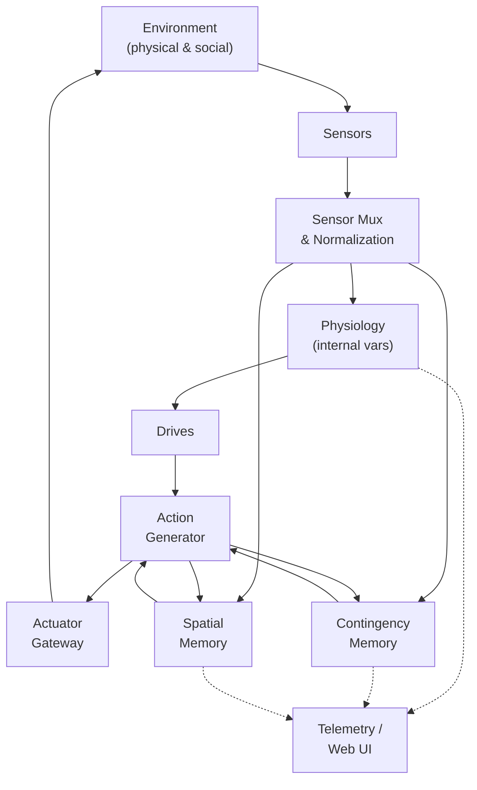
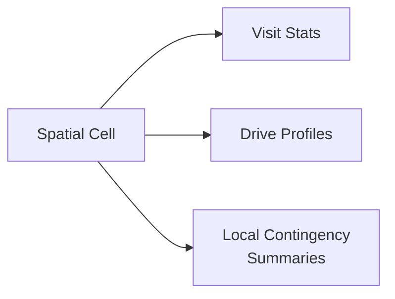
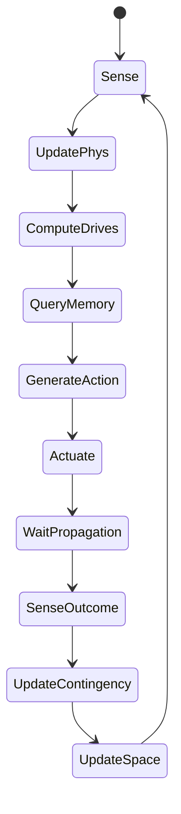
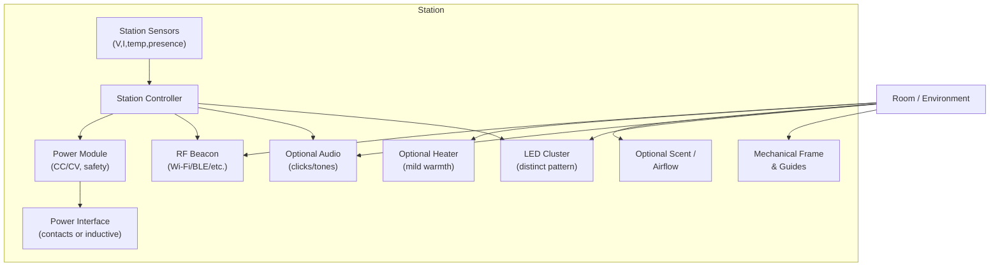
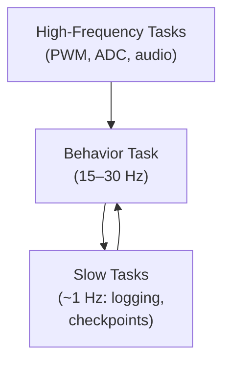

## Table of Contents

1. [Introduction](#1-introduction)  
2. [Historical and Conceptual Background](#2-historical-and-conceptual-background)  
   1. [Cybernetics and Regulation](#21-cybernetics-and-regulation)  
   2. [Grey Walter’s Tortoises](#22-grey-walters-tortoises)  
   3. [Braitenberg Vehicles and Synthetic Psychology](#23-braitenberg-vehicles-and-synthetic-psychology)  
   4. [Behavior-Based Robotics and Subsumption](#24-behavior-based-robotics-and-subsumption)  
   5. [Intrinsic Motivation and Homeostatic Reinforcement Learning](#25-intrinsic-motivation-and-homeostatic-reinforcement-learning)  
   6. [Embodied Cognition, Ethology, and Stigmergy](#26-embodied-cognition-ethology-and-stigmergy)  
   7. [Game Theory, Economics, and Foraging](#27-game-theory-economics-and-foraging)  
   8. [Emergent Behavior in Animal-Inspired Robotics](#28-emergent-behavior-in-animal-inspired-robotics)  
3. [Project Overview and Design Goals](#3-project-overview-and-design-goals)  
4. [System Architecture](#4-system-architecture)  
   1. [System Overview Diagram](#41-system-overview-diagram)  
   2. [Layers and Responsibilities](#42-layers-and-responsibilities)  
5. [The Body: Sensors and Actuators](#5-the-body-sensors-and-actuators)  
   1. [Actuators](#51-actuators)  
   2. [Sensors](#52-sensors)  
   3. [Body Schema as an Emergent Construct](#53-body-schema-as-an-emergent-construct)  
6. [Internal Physiology and Drives](#6-internal-physiology-and-drives)  
   1. [Variables and Dynamics](#61-variables-and-dynamics)  
   2. [Drive Modulation Algorithm](#62-drive-modulation-algorithm)  
7. [Contingency Memory](#7-contingency-memory)  
   1. [Data Structure](#71-data-structure)  
   2. [Update Algorithm](#72-update-algorithm)  
   3. [No Privileged Semantics](#73-no-privileged-semantics)  
8. [Spatial Memory and Navigation](#8-spatial-memory-and-navigation)  
   1. [Spatial Representation](#81-spatial-representation)  
   2. [Action Biasing from Space](#82-action-biasing-from-space)  
9. [Core Loop](#9-core-loop)  
   1. [Behavior Flow Diagram](#91-behavior-flow-diagram)  
   2. [Core Loop Pseudocode](#92-core-loop-pseudocode)  
10. [Input/Output Modalities and Emergent Uses](#10-inputoutput-modalities-and-emergent-uses)  
    1. [Light and Phototaxis-Like Behavior](#101-light-and-phototaxis-like-behavior)  
    2. [RF Fields as Digital Gradients](#102-rf-fields-as-digital-gradients)  
    3. [Chemosensation and Scent Trails](#103-chemosensation-and-scent-trails)  
    4. [Touch and Collision](#104-touch-and-collision)  
    5. [Acoustic and Vibrational Coupling](#105-acoustic-and-vibrational-coupling)  
    6. [Battery as “Just Another Input”, Coupled to Energy](#106-battery-as-just-another-input-coupled-to-energy)  
11. [Charging Station as an Emergent Attractor](#11-charging-station-as-an-emergent-attractor)  
12. [Emergent Phenomena and Cross-Disciplinary Links](#12-emergent-phenomena-and-cross-disciplinary-links)  
    1. [Mechanical Voice and Prosody](#121-mechanical-voice-and-prosody)  
    2. [Individual Differences and “Personality”](#122-individual-differences-and-personality)  
    3. [Social and Crowd-Level Effects](#123-social-and-crowd-level-effects)  
    4. [Game Design, Art, and Education](#124-game-design-art-and-education)  
13. [Life-State Persistence and Body Transfer](#13-life-state-persistence-and-body-transfer)  
14. [Implementation on ESP32-Class Hardware](#14-implementation-on-esp32-class-hardware)  
    1. [Software Structure](#141-software-structure)  
    2. [Memory and Timing Constraints](#142-memory-and-timing-constraints)  
15. [Experimental Program and Ablations](#15-experimental-program-and-ablations)  
16. [What This Project Illustrates and Future Directions](#16-what-this-project-illustrates-and-future-directions)  
17. [Related Projects and Prior Art in Practice](#17-related-projects-and-prior-art-in-practice)  
18. [Philosophical Boundaries](#18-philosophical-boundaries)  
19. [References](#19-references)  

---

## 1. Introduction

The problem is simple to state and hard to do well: **make a small, cheap, battery-powered machine look alive**.

Not intelligent in the large-model sense, not conversational, and not necessarily useful for a fixed task. Instead, we want a machine that appears to have:

- internal variables that drift over time,  
- competing needs and priorities,  
- a body that constrains what it can do,  
- an environment that pushes back,  
- a history and imperfect memory,  
- consequences that follow from its actions,  
- changing preferences and habits,  
- periods of activity and rest,  
- enough stochasticity that its future is not trivially predictable.

Humans are extremely sensitive to motion, timing, and contingency. A few sensors, motors, delays, and feedback loops are enough for us to describe behavior using words like *curious*, *cautious*, *bored*, or *interested*. Heider and Simmel’s classic experiment showed that people attribute agency and intent even to moving geometric shapes.

In this project, such words are **observer-level summaries** of dynamics, not claims about subjective experience. The concrete engineering goal is:

> Construct a machine whose behavior is best understood in terms of internal regulation, learning, and interaction with its environment, rather than in terms of fixed scripts.

The central constraints are deliberate:

- **No large neural network.**  
- **No cloud inference.**  
- **No hand-authored behavior tree.**

Instead, we rely on:

- a structured description of the **body** (sensors and actuators),  
- a small vector of **physiological variables and drives**,  
- a compact, decaying **contingency memory** of action→sensation relationships,  
- a stochastic **action generator** modulated by drives and history,  
- a coarse **spatial memory**,  
- an optional **metabolic subsystem** that ties behavior to energy.

The remainder of the article presents the historical background, theoretical framework, system architecture, algorithms, similarities to existing work, and experimental considerations for this synthetic ethology platform.

---

## 2. Historical and Conceptual Background

### 2.1 Cybernetics and Regulation

Norbert Wiener’s *[Cybernetics: Or Control and Communication in the Animal and the Machine](https://en.wikipedia.org/wiki/Cybernetics)* framed intelligent behavior as **regulation through feedback** rather than symbolic inference. A thermostat does not “understand” weather; it maintains temperature by sensing deviations and acting to reduce them.

Key ideas we adopt:

- **Homeostasis.** Maintain internal variables within viable bands.  
- **Allostasis.** Change parameters in anticipation of future demands, not just reactions to deviations.

Biology offers countless examples: temperature regulation, blood glucose control, osmotic balance. Homeostatic variables drift; organisms act to restore them. Here, drives emerge from **deviations** of internal variables from preferred ranges and bias actions that historically reduce those deviations.

### 2.2 Grey Walter’s Tortoises

In the late 1940s, W. Grey Walter built electro-mechanical “tortoises” (Elmer and Elsie) coupling photocells and touch sensors directly to motors. Without digital computation, they appeared to explore, avoid obstacles, and return to a hutch to “feed” on light and recharge. These robots remain canonical examples that simple analog control loops can yield rich behavior.

Our architecture inherits Walter’s emphasis on **tight sensorimotor coupling** but extends it with explicit internal physiology, memory, and a programmable microcontroller substrate.

### 2.3 Braitenberg Vehicles and Synthetic Psychology

Valentino Braitenberg’s *[Vehicles: Experiments in Synthetic Psychology](https://mitpress.mit.edu/9780262521123/vehicles/)* showed how minimal wiring patterns from sensors to motors produce strikingly interpretable behaviors: approach, avoidance, “aggression”, “fear”, “curiosity”.

The key methodological lesson is **synthetic psychology**:  
build simple systems bottom-up and ask which psychological descriptions humans spontaneously apply. Our code never uses notions like “goal” or “emotion”; those remain observer vocabulary.

### 2.4 Behavior-Based Robotics and Subsumption

Rodney Brooks’ [subsumption architecture](https://people.csail.mit.edu/brooks/papers/robust-layers.pdf) used layers of simple behaviors, where higher layers suppressed lower-level outputs. There was no central world model; behavior emerged from layer interactions and the environment.

We retain:

- locality and concurrency,  
- incremental layering on real hardware,

but avoid explicit “behavior modules” (*wander*, *avoid*, *dock*). Instead we keep:

- sensor streams,  
- actuator channels,  
- statistics of their correlations, in context.

### 2.5 Intrinsic Motivation and Homeostatic Reinforcement Learning

In computational neuroscience and RL, **homeostatic reinforcement learning** (HRL) treats the maintenance of internal variables as the underlying objective of behavior. Keramati and Gutkin’s work formalizes how classical RL can be grounded in physiological drives, explaining risk aversion, satiation, and other behavioral regularities.(Keramati & Gutkin, 2014)

Recent work such as Yoshida & Kuniyoshi’s “Embodied Neural Homeostat” demonstrates that homeostasis-driven RL can yield **integrated behaviors** like walking, foraging, and temperature control in real robots, using internal energy and temperature dynamics as primary signals.(Synthesising Integrated Robot Behaviour through Reinforcement Learning for Homeostasis | bioRxiv, 2024) 

Our platform is intentionally lighter: we do not run a full value-function-based HRL pipeline. Instead, we:

- maintain a small set of **drives** over internal variables,  
- use **contingency memory** to bias action sampling based on past outcomes,  
- rely on stochastic policy sampling rather than gradient-based RL.

Conceptually, we sit between hand-crafted behavior trees and fully learned policies.

### 2.6 Embodied Cognition, Ethology, and Stigmergy

Embodied cognition argues that cognition is not only “in the brain” but distributed across **body and environment**. Ethology emphasizes that behavior must be understood in the ecological niche. Concepts like **stigmergy** show how indirect traces (pheromone trails, footprints) mediate social coordination.

Our robots:

- live in physical rooms with light, RF fields, obstacles, and humans,  
- may emit chemical, acoustic, and visual traces,  
- respond to these traces later as if they “meant” something.

All semantics are imposed post-hoc by observers; the firmware only ever sees correlations and contingencies.

### 2.7 Game Theory, Economics, and Foraging

Several concepts from economics and game theory parallel this design:

- **Optimal foraging theory** treats animal foraging as a utility-maximization problem under uncertainty and depletion; modern RL work reproduces patch-selection behavior with deep agents in continuous environments.(Yoshida et al., 2024)  
- **Utility concavity** and **risk aversion** in economic theory mirror homeostatic drive concavity: as an internal variable approaches its comfortable range, the marginal value of further gains diminishes, encouraging risk-averse choices.(Keramati & Gutkin, 2014)  
- **Mixed strategies** in evolutionary game theory correspond to **stochastic policies** in RL and to our use of controlled randomness: never fully deterministic, always exploring.

Our architecture adopts these indirectly:

- drives are concave around target ranges,  
- stochastic action generation acts like a mixed strategy over embodied moves,  
- spatial and contingency memories coarsely approximate value estimates without ever computing them as such.

### 2.8 Emergent Behavior in Animal-Inspired Robotics

A growing literature puts animal-inspired robots into real environments, using them as **physical models** of behavior. An overview by Gómez-Marín and colleagues summarizes work on social interaction, vocal production, and goal-directed reaching in neurorobotics, arguing that robots and animals share “skin in the game”: friction, noise, wear, and embodiment.(Gomez-Marin & Zhang, 2022)

Closer to this project, recent systems like the Embodied Neural Homeostat (ENH) show emergence of integrated behavior (locomotion, foraging, thermal regulation) from homeostatic drives in physical robots.(Synthesising Integrated Robot Behaviour through Reinforcement Learning for Homeostasis | bioRxiv, 2024)  

Swarm-level studies use evolutionary algorithms (e.g., NEAT) to evolve local controllers in simulation that yield group patterns such as flocking, collective transport, or coordinated patrolling.(“Learning Emergent Behavior in Robot Swarms with NEAT,” 2023)  

Compared with these, the present project:

- emphasizes **resource-constrained microcontrollers**,  
- avoids large neural networks and external training,  
- treats **every signal, including battery**, as uninterpreted at the sensor level,  
- focuses on **single-agent but socially and ecologically situated** behavior, with optional extensions to groups.

---

## 3. Project Overview and Design Goals

We aim for an architecture that:

1. **Runs on an ESP32-class microcontroller.**  
   - No external GPU or host PC.  
   - All learning and control are on-device.

2. **Treats signals symmetrically.**  
   - No hard-coded semantics for collision, battery, light, sound, RF, etc.  
   - Raw sensor channels are numbers; meaning is emergent.

3. **Implements a minimal “organism” architecture.**  
   - A small set of internal variables (“physiology”).  
   - Drives derived from deviations from target bands.  
   - A lossy, decaying contingency memory relating recent actions to subsequent sensory changes.  
   - A coarse spatial memory.  
   - A stochastic action generator modulated by drives and memories.

4. **Connects behavior to energy without scripting it.**  
   - Battery is just another input, albeit coupled numerically into `h_energy`.  
   - A charging station is a physical object with particular sensory profiles and power dynamics, not a symbolic goal.

5. **Supports serializable “life states”.**  
   - The organism can be paused, serialized, and restored into a different body.

6. **Is suitable as a research/education platform.**  
   - Easy to instrument and log.  
   - Easy to ablate components for experiments.

---

## 4. System Architecture

### 4.1 System Overview Diagram



This diagram uses simple node IDs, HTML `<br/>` for multi-line labels, and only ASCII characters to avoid Mermaid parsing issues.

### 4.2 Layers and Responsibilities

- **Body layer**  
  - Abstracts hardware into typed input/output channels.  
  - Encodes only physical constraints: ranges, update rates, safety limits.

- **Core loop**  
  - Maintains physiology and drives.  
  - Tracks contingencies between action deltas and sensor deltas.  
  - Maintains a coarse spatial map.  
  - Generates new actions from baseline + noise + memory-derived bias.

- **Observation layer**  
  - Streams internals for analysis and visualization.  
  - Allows downloading/restoring organism state.

---

## 5. The Body: Sensors and Actuators

### 5.1 Actuators

Actuators are generic effectors. The system does not know what they “mean”.

Example actuator set:

| Name                 | Type       | Range    | Physical Example                          |
|----------------------|------------|----------|-------------------------------------------|
| `motor_left/right`   | continuous | -1 … +1  | Differential drive motors                 |
| `servo_pan/tilt`     | continuous | -1 … +1  | Head or sensor orientation                |
| `vibe_motor`         | continuous | 0 … 1    | Vibration motor                           |
| `grind_motor`        | continuous | 0 … 1    | Noisy mechanical actuator (“voice”)       |
| `led_r/g/b`          | continuous | 0 … 1    | RGB lighting / signaling                  |
| `fan`                | continuous | 0 … 1    | Airflow actuator                          |
| `pump/atomizer`      | continuous | 0 … 1    | Fluid or scent emission                   |
| `heater`             | continuous | 0 … 1    | Local thermal field                       |
| `electromagnet`      | continuous | 0 … 1    | Gripping, field perturbation              |

Each actuator has:

- range and rate limits,  
- a cost estimate (used in physiology updates),  
- safety envelopes (e.g., thermal limits).

### 5.2 Sensors

Sensors provide normalized numeric streams. No label is privileged.

Example sensors:

| Name                          | Type        | Example Hardware                         |
|-------------------------------|-------------|------------------------------------------|
| `mic_energy`, bands, peaks   | continuous  | MEMS microphone                          |
| `distance_*`                  | continuous  | ToF, ultrasonic, IR                      |
| `touch_*`                     | cont/binary | Bump switches, capacitive strips         |
| `light_*`, `uv`              | continuous  | Photodiodes, light sensors               |
| `imu_accel/gyro/mag`         | continuous  | 6-axis or 9-axis IMU                     |
| `temperature`, `humidity`    | continuous  | Environmental sensors                    |
| `gas`, `air_quality`         | continuous  | Metal-oxide gas sensor                   |
| `rf_rssi_*`                  | continuous  | Wi-Fi/BLE RSSI or beacons                |
| `battery_voltage`, `current` | continuous  | ADC monitoring of power rails            |
| `internal_temp`              | continuous  | MCU or board temperature                 |

Battery signals enter at this layer as raw numbers, like any other sensor.

### 5.3 Body Schema as an Emergent Construct

We do **not** predefine kinematics or a body model. Instead, the system gradually learns regularities such as:

- “When `motor_left` and `motor_right` change like this, IMU and `distance_front` change like that.”  
- “When `servo_pan` increases, a particular light sensor often saturates.”

This echoes how infants learn their own bodies through co-occurrence of actuation, proprioception, and exteroception.

---

## 6. Internal Physiology and Drives

### 6.1 Variables and Dynamics

The internal state contains a small vector of slow variables, for example:

- `h_energy` — abstract “resource” level. It is **numerically coupled** to battery readings and actuator costs, but never treated as “battery percentage” symbolically.  
- `h_fatigue` — accumulated exertion.  
- `h_safety` — recent history of collisions, extreme temperatures, etc.  
- `h_arousal` — global activity or responsiveness.  
- `h_curiosity` — based on novelty or prediction error.  
- `h_boredom` — time spent in low-change regimes.  
- `h_social` — history of correlated signals from other robots / humans.

Each variable:

- integrates selected sensor channels,  
- decays or recovers over time,  
- may be coupled (e.g., high exertion drains `h_energy` and raises `h_fatigue`).

Drives are scalar pressures derived from deviations from preferred bands:

```text
drive[name] = deviation(h_name, target_range[name])
```

### 6.2 Drive Modulation Algorithm

Drives shape the scale and direction of stochastic exploration.

```python
def compute_drives(phys, targets):
    drives = {}
    for name, value in phys.items():
        lo, hi = targets[name]
        if value < lo:
            drives[name] = (lo - value) / (hi - lo + 1e-6)
        elif value > hi:
            drives[name] = (value - hi) / (hi - lo + 1e-6)
        else:
            drives[name] = 0.0
    return drives

def calculate_fuzz_scale(drives):
    curiosity = drives.get("h_curiosity", 0.0)
    boredom   = drives.get("h_boredom", 0.0)
    energy    = drives.get("h_energy", 0.0)   # high = low resource
    safety    = drives.get("h_safety", 0.0)   # high = unsafe

    fuzz = (
        0.6 * curiosity +
        0.4 * boredom   -
        0.4 * energy    -
        0.3 * safety
    )
    return clamp(fuzz, 0.03, 0.8)
```

Intuitively:

- high curiosity and boredom → more exploration;  
- high energy and safety pressures → less exploration, more exploitation.

---

## 7. Contingency Memory

### 7.1 Data Structure

Contingency memory holds many small records of “when I did X, Y tended to follow”:

```text
Entry:
    action_delta_code    # compressed Δaction at t-1
    sensor_delta_code    # compressed Δsensor at t
    strength             # reliability / confidence
    age                  # ticks since last reinforcement
    ctx_hash (optional)  # coarse context (space, physiology bins)
```

Quantization and hashing compress high-dimensional deltas into small codes so memory remains bounded.

### 7.2 Update Algorithm

```python
LEARN = 0.1
DECAY = 0.005
MAX_ENTRIES = 1024

def update_contingency(mem, d_action, d_sensor, ctx_hash=None):
    # decay existing entries
    for e in mem.values():
        e.strength *= (1.0 - DECAY)
        e.age += 1

    key = hash_quantized(d_action, d_sensor, ctx_hash)

    if key in mem:
        e = mem[key]
        e.strength += LEARN * (1.0 - e.strength)
        e.age = 0
    else:
        mem[key] = Entry(
            action_delta_code = compress(d_action),
            sensor_delta_code = compress(d_sensor),
            strength          = LEARN,
            age               = 0,
            ctx_hash          = ctx_hash,
        )

    if len(mem) > MAX_ENTRIES:
        prune(mem)  # drop weakest / oldest
```

When generating new actions, the system can query for entries whose `sensor_delta_code` historically led to improvements in drives and bias toward their `action_delta_code`.

### 7.3 No Privileged Semantics

The firmware never encodes:

- “sensor X corresponds to collision”,  
- “sensor Y corresponds to low battery”,  
- “action Z is ‘move forward’.”

Those are interpretations we may assign later. For the agent, there are only:

- evolving statistics over deltas,  
- and reuse of patterns that historically improved internal variables.

---

## 8. Spatial Memory and Navigation

### 8.1 Spatial Representation

We use a light-weight spatial representation, for example a coarse 2-D grid or a set of “place cells”.

Each cell stores:

- visitation count and recency,  
- average changes in key drives when entering, staying, or leaving,  
- simple summaries of observed contingencies there.



### 8.2 Action Biasing from Space

When drives are high, spatial memory suggests promising directions.

```python
def best_cell_for(drives, spatial_map):
    best_score, best_cell = -1e9, None
    for cell in spatial_map.cells:
        score = 0.0
        for name, d in drives.items():
            w = DRIVE_WEIGHTS.get(name, 1.0)
            score += w * cell.expected_improvement[name]
        if score > best_score:
            best_score, best_cell = score, cell
    return best_cell

def spatial_bias(position, drives, spatial_map):
    cell = best_cell_for(drives, spatial_map)
    if cell is None:
        return zero_action_bias()
    direction = cell.center - position
    motor_bias = direction_to_motor(direction)
    urgency = max(drives.values())
    return motor_bias * urgency
```

A “charging corner” is simply a region where internal energy tends to improve.

---

## 9. Core Loop

### 9.1 Behavior Flow Diagram



This uses standard `stateDiagram-v2` syntax and simple state names.

### 9.2 Core Loop Pseudocode

```c
void tick() {
    // 1. Sense
    SensorReadings s_t = read_sensors();

    // 2. Internal updates
    update_physiology(&phys, s_t);             // includes battery -> h_energy mapping
    DriveVector drives = compute_drives(phys, drive_targets);

    // 3. Candidate actions
    ActionVector a_base  = generate_baseline_action();
    float        fuzz    = calculate_fuzz_scale(drives);
    ActionVector a_noise = sample_noise_vector() * fuzz;

    BiasVector b_cont  = contingency_bias(memory, phys, s_t);
    BiasVector b_space = spatial_bias(position, drives, spatial_map);

    ActionVector a_t = clamp_action(a_base + a_noise + b_cont + b_space);

    // 4. Act
    apply_actions(a_t);

    // 5. Wait for physical propagation
    delay_ms(PROPAGATION_DELAY);

    // 6. Observe consequences
    SensorReadings s_tp1 = read_sensors();

    DeltaAction d_a = diff_actions(prev_action, a_t);
    DeltaSensor d_s = diff_sensors(s_t, s_tp1);

    // 7. Learn
    uint32_t ctx = context_hash(position, phys);
    update_contingency(&memory, d_a, d_s, ctx);
    update_spatial(&spatial_map, position, drives, d_s);

    prev_action = a_t;
}
```

---

## 10. Input/Output Modalities and Emergent Uses

### 10.1 Light and Phototaxis-Like Behavior

**Inputs:** `light_*`, `temperature`.  
**Outputs:** motors, servos, LEDs, heater.

Emergent possibilities:

- drift toward brightness (windows, lamps) when curiosity-like drives dominate,  
- retreat from heat when safety worsens with rising temperature,  
- internal variables entrained to day/night cycles, yielding activity rhythms.

Self-emitted LEDs can support **self-inspection** and **inter-robot signaling** when robots see each other’s flashes.

### 10.2 RF Fields as Digital Gradients

**Inputs:** `rf_rssi_*`.  
**Outputs:** locomotion, RF beacons.

RF strength often correlates with human presence, power availability, or network access. The system may discover that:

- some locations yield higher `rf_rssi` and later improvements to “social” or energy-related variables,  
- beacons define **digital territories**.

From a sociology and urban-studies perspective, these are analogues of public squares, Wi-Fi hotspots, and infrastructure hubs.

### 10.3 Chemosensation and Scent Trails

**Inputs:** `gas`, `humidity`, etc.  
**Outputs:** `pump`, `atomizer`, brush or fan.

Robots can:

- lay down “chemical signatures” where certain drives improved,  
- later follow or avoid regions with those signatures,  
- converge on trail networks analogous to ant foraging paths, shaped by evaporation and deposition.

This is direct hardware for stigmergy experiments.

### 10.4 Touch and Collision

**Inputs:** `touch_*`, sudden IMU changes.  
**Outputs:** motors, vibration, LEDs, sound.

Collisions are never special-cased. They are just patterns where:

- certain touch or IMU channels spike when certain actions are taken,  
- those spikes correlate with later changes in `h_safety`, `h_energy`, etc.

From repeated exposure, the system can:

- favor motion patterns that reduce the chance of these patterns,  
- or, under some experimental manipulations, seek them.

This aligns with classical conditioning and simple risk-avoidance or risk-seeking learning.

### 10.5 Acoustic and Vibrational Coupling

**Inputs:** microphone bands, peak frequency.  
**Outputs:** `grind_motor`, `vibe_motor`, general motion.

Uses:

- self-monitoring of actuator health (motor sound spectra),  
- emergent “mechanical voice” where actuation patterns become expressive,  
- inter-robot signaling through coded bursts of vibration or tone sequences.

This connects to bioacoustics and human–robot interaction via tapping, clapping, or speech-like patterns.

### 10.6 Battery as “Just Another Input”, Coupled to Energy

**Inputs:** `battery_voltage`, `current`.  
**No explicit “charge” routine.**

Battery signals enter as normal sensor channels. The only “privilege” they have is in the physiology update:

- `h_energy` is updated partly from battery readings and partly from behavior-dependent load estimates,  
- `h_energy` is then treated like any other internal variable; drives are deviations from a comfortable band,  
- if certain spatial regions or action patterns systematically raise `battery_voltage`, those patterns become associated with improvements in `h_energy`,  
- drives then bias future exploration toward them.

Externally, this looks like self-charging behavior. Internally, it is homeostatic regulation driven by sensor streams and contingencies.

---

## 11. Charging Station as an Emergent Attractor

The charging station is part of the **ecology**, not a coded “home base”. It should:

- broadcast rich **sensory gradients** (RF, light, sound, scent, temperature),  
- deliver **power** only when the body is correctly positioned,  
- provide **sensorically obvious feedback** when charging is active or complete,  
- never communicate “I am a charger” at the protocol level.

From the robot’s perspective, the station is just a **cluster of regularities**:

- being near this object correlates with rising `battery_voltage`,  
- and with consistent patterns on other sensors (light, sound, RF, etc.).

Over time, those regularities make station-seeking behavior emergent.

### 11.1 Station Architecture Overview

The station is:

- a physical **dock** that constrains pose enough to align contacts or inductive coils,  
- a bundle of **stimulus emitters** (RF beacon, LED pattern, optional sound/scent/heat),  
- a **power electronics module** that supplies current safely,  
- a set of **completion cues** that change when charging stops.



For the robot, this appears as:

- strong local RF signature,  
- characteristic LED spectrum and flicker,  
- distinctive acoustic and/or airflow pattern,  
- localized warmth,  
- sudden, sustained rise in `battery_voltage` once contact is made.

### 11.2 Mechanical Design and Contact Geometry

Goals:

- **Self-alignment**: make it easy to “fall into” a valid charging pose via bumping and pushing.  
- **Robust contacts**: tolerate misalignment, dirt, wear.  
- **No exact pose requirement in code**: alignment handled by mechanics.

Suggested features:

- **Funnel entrance**:  
  - two sloped side walls guiding the chassis toward a central pocket,  
  - a shallow ramp with a soft stop so low-speed collisions bring the robot in.

- **Contact design**:  
  - spring-loaded pogo pins on the station, large pads on the robot, or  
  - inductive coils (Qi-like) with a generous coupling margin,  
  - a mechanical “nose” or bumper that helps the robot “nose in” until contacts compress.

- **Anti-snag geometry**:  
  - chamfered edges, no sharp lips,  
  - enough clearance for escape maneuvers if the robot backs out.

Thus, random or slightly biased approaches often result in a valid power connection. Once connected, geometry tends to stabilize pose and reduce unwanted motion.

### 11.3 Sensory Lures: Making the Station Salient

The station should emit **multi-modal gradients** that:

- can be sensed from **far away** (RF, light, low-frequency sound),  
- become more intense or structured when **closer or correctly aligned**,  
- are statistically associated with **rising internal energy** once charging starts.

#### RF Lure

- Dedicated Wi-Fi/BLE SSID or beacon with high power and a distinctive RSSI profile.  
- Optionally **pulsed**, giving a recognizable temporal pattern near the dock.

Robot side: RF is just `rf_rssi_*`. If “being near high RSSI with that pattern” tends to precede `h_energy` improvement, contingencies will favor moving into RF peaks.

#### Optical Lure

- High-contrast **LED pattern** with:  
  - distinctive color mix,  
  - simple temporal code (slow pulse, repeating motif),  
  - visibility over distance and angle.

Robot side: appears in `light_*` sensors; spatial memory may encode “cells with this light distribution tend to be good for energy”.

#### Acoustic / Vibration Lure

- Small speaker emitting low-duty cycle clicks or tones at a distinctive frequency.  
- Optional low-frequency vibration transmitted through a ramp or floor panel.

Robot side: shows up as specific spectral signatures in microphone and/or IMU.

#### Scent / Airflow / Temperature Lure

- Gentle airflow or warmth near the dock.  
- Mild scent via an atomizer or solid fragrance.

Robot side: changes in `gas`, `humidity`, `temperature` co-vary with other station cues.

### 11.4 Power Delivery and Safety

Station-side power module:

- CC/CV regulation sized for the robot’s battery chemistry,  
- over-current, over-temperature, and reverse-polarity protection,  
- current and voltage sensing for station-internal state (“charging”, “full”).

Robot-side:

- only sees analog outcomes:  
  - `battery_voltage` and possibly `current` rising,  
  - internal thermistors warming slightly if charging generates heat,  
  - these map into `h_energy` and `h_safety` updates.

There is **no explicit “start charging” RPC**. Interaction is purely physical and sensory.

### 11.5 Signaling “Charging” vs “Done” Without Semantics

The station should change its **sensory profile** when:

1. Charging is **active**,  
2. Charging is **complete** (or paused).

These differences must be clear in sensor space but not labeled in code.

Examples:

- **Active charging**:  
  - LEDs: slow pulsing wave,  
  - sound: occasional faint click or hum,  
  - RF beacon: regular 1 Hz bursts.

- **Charging complete**:  
  - LEDs: steady glow or different color mix,  
  - sound: silence or rare “heartbeat” tick,  
  - RF beacon: reduced duty cycle or different pulse spacing.

From the robot’s perspective:

- certain combinations of station cues + rising `battery_voltage` correlate with improved `h_energy`,  
- later, when `battery_voltage` plateaus and `h_energy` is near target, cues stabilize into the “full” profile.

Over many episodes, contingency and spatial memory can learn that:

- **approaching** the “charging profile” tends to precede `h_energy` improvement,  
- **remaining** in the “full profile” yields little further gain.

Behavior then tends toward:

- entering and staying at the station while “charging profile” persists,  
- leaving more readily when the “full” profile dominates and `h_energy` drive is low.

No code ever says `if low_battery then go_to_station()`.

### 11.6 Example Station Logic

```python
# Pseudocode for station microcontroller
while True:
    v = measure_robot_voltage()   # or station contact voltage
    i = measure_current()
    t = measure_temp()

    charging_active = (i > I_MIN_ACTIVE) and (t < T_MAX)

    if charging_active:
        if v > V_FULL_THRESHOLD and i < I_TAPER_THRESHOLD:
            state = "FULL"
        else:
            state = "CHARGING"
    else:
        state = "IDLE"

    if state == "IDLE":
        set_led_mode("attractor_idle")
        set_rf_pattern("beacon_idle")
        set_audio_mode("quiet")
    elif state == "CHARGING":
        set_led_mode("charging_pulse")
        set_rf_pattern("beacon_active")
        set_audio_mode("slow_click")
    elif state == "FULL":
        set_led_mode("full_solid")
        set_rf_pattern("beacon_full")
        set_audio_mode("rare_tick")

    sleep_ms(100)
```

The robot never sees `"CHARGING"` or `"FULL"` as symbols; it only experiences the sensory shifts.

### 11.7 Emergent Charging Storyline

A typical emergent narrative:

1. **Early life**  
   - Robot wanders randomly.  
   - Occasionally collides with ramp, is funneled in, accidentally making contact.  
   - `battery_voltage` rises; `h_energy` improves.

2. **Memory formation**  
   - Contingency memory stores associations between approach actions, station cues, and subsequent `h_energy` improvements.  
   - Spatial memory notes that certain locations precede such episodes.

3. **Behavior shaping**  
   - When `h_energy` deviates strongly (simulated “hunger”), drives bias exploration.  
   - Patterns that historically improved `h_energy` (movements toward station cues) become more probable.

4. **Charging completion and departure**  
   - Once `battery_voltage` stabilizes and `h_energy` is high,  
   - station cues shift to the “full” profile,  
   - `h_energy` drive relaxes,  
   - stochastic exploration reasserts itself; gentle biases toward remaining weaken and the robot drifts out.

To an observer, the robot “seeks the charging station when low on energy and leaves when full”. In code, it never **knows** what a charging station is.

---

## 12. Emergent Phenomena and Cross-Disciplinary Links

### 12.1 Mechanical Voice and Prosody

Repeated action sequences that improve “social” or curiosity-related drives can produce distinct acoustic signatures:

- rising/falling motor tones,  
- rhythmic tapping,  
- broadband “grind” pulses.

From linguistics and music theory we can borrow:

- prosodic contours (rise–fall, emphasis),  
- rhythmic motifs,  
- call-and-response structures.

Experiments: expose robots to human rhythmic patterns (clapping, tapping) and observe whether particular action-and-sound sequences become more likely after “successful” interactions.

### 12.2 Individual Differences and “Personality”

Because:

- exploration is stochastic,  
- memory is lossy,  
- spatial histories differ,

nominally identical robots develop distinct **behavioral profiles**. Behavioral ecology calls such persistent individual differences “behavioral syndromes”.

We can measure:

- risk tolerance (distance to obstacles, collision rate),  
- exploration rate (spatial coverage),  
- sociality (time near conspecifics or humans),  
- persistence (how long patterns are repeated).

Psychology and psychiatry provide a rich vocabulary to interpret perturbations: altering decay rates or drive gains can yield lethargic, manic, compulsive, or avoidant “personalities”.

### 12.3 Social and Crowd-Level Effects

With many robots in a shared environment:

- stigmergic cues (scent, RF, light patterns) become shared media,  
- simple local rules yield clustering, segregation, or flocking-like motion,  
- human movement influences robot distributions and vice versa.

This connects to:

- **sociology** (norm formation, crowd dynamics),  
- **collective behavior** in animals,  
- **economics** of congestion and resource competition.

Swarm-robotics work using evolutionary methods and NEAT to generate emergent group behavior offers a useful comparison: our system does not optimize a group objective, but similar group-level phenomena may appear as robots individually chase local drive improvements.(“Learning Emergent Behavior in Robot Swarms with NEAT,” 2023)

### 12.4 Game Design, Art, and Education

From game design:

- crafting legible behavior signatures humans can read and respond to,  
- tuning “reward” landscapes (via environment design) to elicit interesting emergent strategies.

From art:

- robots as kinetic sculptures,  
- emergent narratives formed by their trajectories and interactions,  
- audio-visual aesthetics using mechanically produced sound and light.

From education:

- concrete demonstrations of homeostasis, adaptation, dynamical systems, emergence,  
- visualization tools mapping internal variables to colors, shapes, or sounds.

---

## 13. Life-State Persistence and Body Transfer

The *organism* is defined as a serializable state blob:

```json
{
  "version": 3,
  "age_s": 172800,
  "physiology": { "h_energy": 0.73, "h_safety": 0.91 },
  "drives": { "h_curiosity": 0.82, "h_boredom": 0.12 },
  "contingencies": [ /* compressed entries */ ],
  "spatial_memory": [ /* grid or place-cell summaries */ ],
  "stats": { "risk_tolerance": 0.34, "mean_speed": 0.18 },
  "channel_fingerprint": "a1b2c3d4"
}
```

Mechanism:

- state can be downloaded from one chassis and uploaded into another,  
- a mapping layer remaps channels where possible and gradually forgets mismatched contingencies,  
- observers experience continuity of “character” even as body and environment change.

This gives an experimental handle on **embodied identity**: what, if anything, remains the same when you change the body but preserve part of the internal history?

---

## 14. Implementation on ESP32-Class Hardware

### 14.1 Software Structure



- **High-frequency tasks**  
  - Motor PWM, audio sampling, quick safety checks.  
  - Interrupt-driven where needed.

- **Behavior task**  
  - Implements the core loop.  
  - Runs at 15–30 Hz.

- **Slow tasks**  
  - State snapshots to flash or external storage.  
  - Telemetry via HTTP/WebSocket.  
  - Occasional parameter adaptation.

### 14.2 Memory and Timing Constraints

To stay microcontroller-friendly:

- use fixed-size arrays for contingency and spatial memory,  
- aggressively quantize and hash to keep entries small,  
- prefer integer or fixed-point arithmetic inside the loop,  
- avoid dynamic allocation,  
- bound per-tick work (e.g., scan only subsets of memory each step).

---

## 15. Experimental Program and Ablations

To treat this as a *scientific* platform:

### 15.1 Metrics

- **Homeostasis quality**: variance of internal variables under perturbations.  
- **Exploration structure**: spatial coverage, visitation entropy.  
- **History dependence**: divergence between individuals with different pasts under matched environments.  
- **Perceived aliveness**: blinded human ratings from short video clips (as used in work on believable agents and animal-inspired robotics).(Gomez-Marin & Zhang, 2022)

### 15.2 Ablations

- remove stochastic exploration (deterministic policy),  
- freeze contingency memory,  
- clear spatial memory,  
- flatten drives (no homeostatic pressure),  
- hide or randomize certain sensors (including battery),  
- decouple battery from `h_energy` to see how much charging behavior is lost.

Comparing ablated and full agents isolates which mechanisms contribute most to diverse, legible behavior.

---

## 16. What This Project Illustrates and Future Directions

### 16.1 What the Project Illustrates

This architecture demonstrates that:

1. **Believable creature-like behavior does not require big models.**  
   Carefully structured local feedback, homeostatic drives, and bounded memory can produce behavior that observers interpret using rich psychological language.

2. **Semantics can emerge from statistics.**  
   Battery, collision, and RF signals start as untyped numbers. Yet, because they systematically affect internal variables, the system comes to behave *as if* it understood “danger”, “safety”, or “charging”, without symbolic representation.

3. **Energy and ecology can be coupled without scripting goals.**  
   The charging station is designed as an attractor in sensor and energy space; “seeking the charger” is an emergent pattern, not a coded routine.

4. **Microcontrollers are sufficient for serious synthetic ethology.**  
   By trading off explicit value functions and large networks for simpler homeostatic and statistical machinery, we can run interesting experiments entirely on-device.

5. **Robots can be used as physical thought experiments about behavior.**  
   Like earlier work on animal-inspired robots and homeostatic RL, the platform blurs lines between robotics, neuroscience, and ethology.(Synthesising Integrated Robot Behaviour through Reinforcement Learning for Homeostasis | bioRxiv, 2024)(Gomez-Marin & Zhang, 2022)

### 16.2 Possible Further Steps

Some natural extensions:

- **Richer physiology.**  
  Add more internal variables (e.g., “temperature comfort”, “social saturation”) and study interactions.

- **Minimal learning rules** closer to biological plasticity.  
  Replace the abstract contingency memory with variants of Hebbian learning or predictive coding.

- **Multi-agent experiments.**  
  Introduce several robots with shared or conflicting drives, and simple stigmergic channels (scent, light, RF tags). Explore collective phenomena and analogues of market-like resource allocation.

- **Task-free vs task-biased regimes.**  
  Keep architecture unchanged but change environment statistics (e.g., how often particular stimuli correlate with drive improvements). Compare to explicit task-focused RL agents in the same morphology.

- **Bridges to formal RL.**  
  Treat the contingency + spatial memories as approximate value structures and compare behavior against HRL models in similar setups.(Keramati & Gutkin, 2014)

- **Open-world benchmarks.**  
  Define shared environments, metrics, and logging formats so others can run comparable experiments on their own microcontroller platforms.

---

## 17. Related Projects and Prior Art in Practice

While this project stresses **extreme on-device simplicity**, it sits in a broader ecosystem of work on emergent behavior and embodied agents:

- **Homeostatic RL in robots.**  
  - Yoshida & Kuniyoshi’s “Embodied Neural Homeostat” implements deep HRL on a physical quadruped, achieving emergent walking, foraging, and temperature regulation under homeostatic objectives.(Synthesising Integrated Robot Behaviour through Reinforcement Learning for Homeostasis | bioRxiv, 2024)  
  - Several studies model animal-like long-term nutritional behavior using homeostatic RL in simulated agents.(Yoshida et al., 2024)

- **Embodied co-design surveys.**  
  - The *Embodied Co-Design for Rapidly Evolving Agents* survey compiles work on jointly optimizing morphology and control, often with deep RL and evolution, and links to multiple open-source implementations (e.g., DERL, emergent hand morphology).(Wang, 2024/2026)  
  These tend to operate in simulation with heavy compute, but share the emphasis on body-environment loops.

- **Swarm emergent behavior with NEAT.**  
  - Work on *Learning Emergent Behavior in Robot Swarms with NEAT* evolves controllers for agents whose local rules yield collective patterns.(“Learning Emergent Behavior in Robot Swarms with NEAT,” 2023)  
  Many of these controllers are available in public GitHub repositories (e.g., swarm benchmarks in CoppeliaSim), though typically targeting desktops or simulators.

- **Animal-inspired neurorobotics.**  
  - A collection of neurorobotics papers shows robots as models for social interaction, vocalization, and goal-directed reaching, with code often accompanying publications via lab GitHub accounts.(Gomez-Marin & Zhang, 2022)

Compared with these, the present project contributes:

- an **explicit, end-to-end specification** of a pure-emergence architecture tuned for ESP32-class boards,  
- an emphasis on **semantic symmetry** of all sensory channels (even battery),  
- a concrete, low-profile **charging station design** that supports emergent self-charging,  
- a blueprint for **life-state transfer** and systematic ablation experiments.

---

## 18. Philosophical Boundaries

This project stays at the levels of:

- **behavior:** patterns of motion and interaction,  
- **organismic organization:** regulation, memory, embodiment.

It does *not* claim:

- subjective experience,  
- moral status,  
- or a solution to consciousness.

It offers a **concrete, tunable dynamical system** where:

- things like “caring” about battery or avoiding collisions arise from low-level statistical structure and feedback,  
- observers can apply concepts from biology, psychology, economics, and sociology without those concepts being present in code.

---

## 19. References

Classics and conceptual background:

- Norbert Wiener, *Cybernetics: Or Control and Communication in the Animal and the Machine*, 1948.  
- W. Grey Walter, *The Living Brain*, 1953.  
- Valentino Braitenberg, *Vehicles: Experiments in Synthetic Psychology*, [MIT Press](https://mitpress.mit.edu/9780262521123/vehicles/), 1984.  
- Rodney A. Brooks, “A robust layered control system for a mobile robot,” *IEEE Journal of Robotics and Automation*, 1986.  
- Warren S. McCulloch, W. Ross Ashby, and others on early homeostatic machine designs.  
- J. J. Gibson, *The Ecological Approach to Visual Perception*, 1979.  
- J. O’Keefe & L. Nadel, *The Hippocampus as a Cognitive Map*, 1978.  
- P.-P. Grassé, “La théorie de la stigmergie,” *Insectes Sociaux*, 1959.

Homeostatic RL and animal-like behavior:

- Mehdi Keramati & Boris Gutkin, “A Reinforcement Learning Theory for Homeostatic Regulation,” *NeurIPS 2011*.  
- Mehdi Keramati & Boris Gutkin, “[Homeostatic reinforcement learning for integrating reward collection and physiological stability](https://elifesciences.org/articles/04811),” *eLife* 3:e04811, 2014.(Keramati & Gutkin, 2014)  
- S. Yoshida & Y. Kuniyoshi, “Synthesising integrated robot behaviour through reinforcement learning for homeostasis (Embodied Neural Homeostat),” bioRxiv, 2024.(Synthesising Integrated Robot Behaviour through Reinforcement Learning for Homeostasis | bioRxiv, 2024)  
- H. Yoshida et al., “Modeling long-term nutritional behaviors using deep homeostatic reinforcement learning,” *PNAS Nexus* (open-access preprint).(Yoshida et al., 2024)

Emergent behavior and neurorobotics:

- A. Gómez-Marín, “[Editorial: Emergent Behavior in Animal-Inspired Robotics](https://www.frontiersin.org/articles/10.3389/fnbot.2022.861831/full),” *Frontiers in Neurorobotics*, 2022.(Gomez-Marin & Zhang, 2022)  
- M. Reséndiz-Benhumea et al., “Testing the social brain hypothesis with minimal models in robotics,” *Frontiers in Neurorobotics*, 2021.  
- A. Amador & G. B. Mindlin, “Low-dimensional biomechanical model of birdsong production,” *Frontiers in Neuroscience*, 2021.

Swarm and emergent control:

- “Learning Emergent Behavior in Robot Swarms with NEAT,” arXiv:2309.14663, 2023.(“Learning Emergent Behavior in Robot Swarms with NEAT,” 2023)  
- E. Pagello et al., “Emergent behaviors of a robot team performing cooperative tasks,” *Advanced Robotics*, 2003.  
- Pranav Rajbhandari, *Swarm CoppeliaSim* (GitHub).

Embodied co-design and morphology:

- Y. Wang et al., “[Embodied Co-Design for Rapidly Evolving Agents: Taxonomy, Frontiers, and Challenges](https://github.com/Yuxing-Wang-THU/SurveyBrainBody),” survey with code links, 2023.(Wang, 2024/2026)  

And many more in the overlapping literatures of artificial life, developmental robotics, and believable agents.

