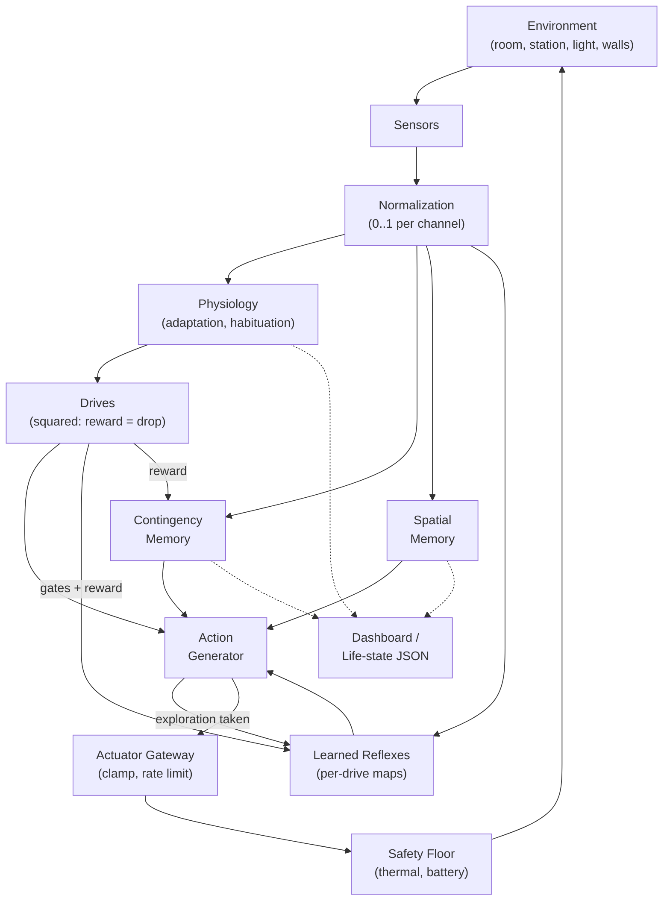
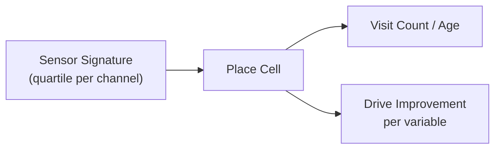
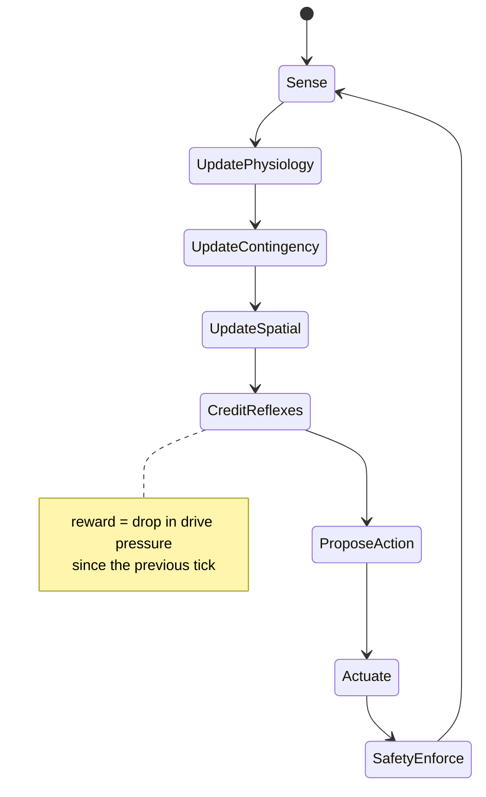
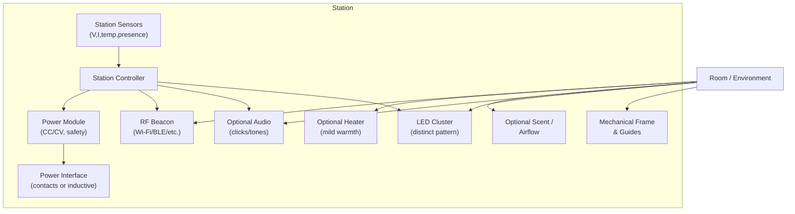
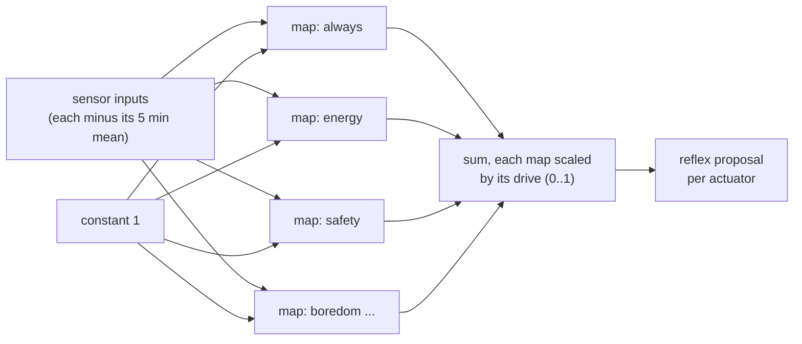
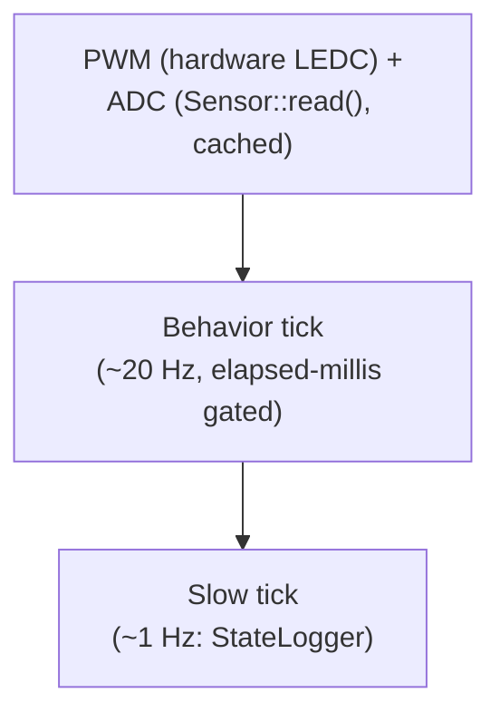

# Emergent: A Synthetic Ethology Platform for ESP32-Class Hardware

[← Back to project overview](index.html)

## Table of Contents

- 1\. [Introduction](#1-introduction)
- 3\. [Project Overview and Design Goals](#3-project-overview-and-design-goals)
- 4\. [System Architecture](#4-system-architecture)
   1. [System Overview Diagram](#41-system-overview-diagram)  
   2. [Layers and Responsibilities](#42-layers-and-responsibilities)  
- 5\. [The Body: Sensors and Actuators](#5-the-body-sensors-and-actuators)
   1. [Actuators](#51-actuators)  
   2. [Sensors](#52-sensors)  
   3. [Body Schema as an Emergent Construct](#53-body-schema-as-an-emergent-construct)  
- 6\. [Internal Physiology and Drives](#6-internal-physiology-and-drives)
   1. [Variables and Dynamics](#61-variables-and-dynamics)  
   2. [Drive Modulation Algorithm](#62-drive-modulation-algorithm)  
- 7\. [Contingency Memory](#7-contingency-memory)
   1. [Data Structure](#71-data-structure)  
   2. [Update Algorithm](#72-update-algorithm)  
   3. [No Privileged Semantics](#73-no-privileged-semantics)  
- 8\. [Spatial Memory](#8-spatial-memory)
   1. [Places from Sensor Signatures](#81-places-from-sensor-signatures)  
   2. [Explore/Exploit Modulation, Not Steering](#82-exploreexploit-modulation-not-steering)  
- 9\. [Core Loop](#9-core-loop)
   1. [Behavior Flow Diagram](#91-behavior-flow-diagram)  
   2. [Core Loop Pseudocode](#92-core-loop-pseudocode)  
- 10\. [Battery as “Just Another Input”, Coupled to Energy](#10-battery-as-just-another-input-coupled-to-energy)
- 11\. [Charging Station](#11-charging-station)
- 12\. [Learned Reflexes](#12-learned-reflexes)
- 13\. [Life-State Persistence and Body Transfer](#13-life-state-persistence-and-body-transfer)
- 14\. [Implementation on ESP32-Class Hardware](#14-implementation-on-esp32-class-hardware)
    1. [Software Structure](#141-software-structure-as-implemented)  
    2. [Memory and Timing Constraints](#142-memory-and-timing-constraints)  
- 15\. [Experimental Program and Ablations](#15-experimental-program-and-ablations)

This document describes what the firmware does. History, prior art,
speculative modality ideas, and philosophy live in [research.md](research.md).
Section numbers are kept stable, so there is a gap (2).

---

## Status

| Layer | Fact |
|---|---|
| Implemented | 20 Hz loop: sense → physiology → drives → memory → action → actuate → learn. Learned sensor→actuator reflexes trained by drive reduction. Named-channel body. SoftAP dashboard. Life-state JSON. Station firmware as a separate state machine. |
| Tested | Host-native tests for bit packing, age saturation, rate-limit clamp, LEDC cap, and organism behavior (energy dynamics, contingency bias, reflex learning rule) against a fake body. Not real hardware. |
| Simulated | The unmodified engine in a modelled room with a station (`src/sim`): learned reflexes lift mean lifespan from 1.26 h to 1.86 h (hand-wired bound 2.46 h). Learns to reach and stay on the dock; not yet to leave when full, and nothing accumulates across lives. |
| Hardware tested | Nothing. No board has run this. |
| Designed / planned | Body declared in a JSON file with per-input ranges, stepper and mic-envelope channel kinds ([example build](example-body.md)); approach-and-dock on hardware; extra boards. |
| Hypothesis | That drives + decaying memory + learned reflexes + noise will look alive on real hardware, including charging as an attractor. Unverified. |

---

## 1. Introduction

The problem is simple to state and hard to do well: **make a small, cheap, battery-powered machine look alive**.

Not intelligent in the large-model sense, not conversational, and not necessarily useful for a fixed task. Instead, we want a machine that appears to have:

- internal variables that drift over time,  
- competing needs and priorities,  
- a body that constrains what it can do,  
- an environment that pushes back,  
- a history and imperfect memory,  
- consequences that follow from its actions,  
- changing preferences and habits,  
- periods of activity and rest,  
- enough stochasticity that its future is not trivially predictable.

Humans are extremely sensitive to motion, timing, and contingency. A few sensors, motors, delays, and feedback loops are enough for us to describe behavior using words like *curious*, *cautious*, *bored*, or *interested*. Heider and Simmel’s classic experiment showed that people attribute agency and intent even to moving geometric shapes.

In this project, such words are **observer-level summaries** of dynamics, not claims about subjective experience. The concrete engineering goal is:

> Construct a machine whose behavior is best understood in terms of internal regulation, learning, and interaction with its environment, rather than in terms of fixed scripts.

The central constraints are deliberate:

- **No large neural network.**  
- **No cloud inference.**  
- **No hand-authored behavior tree.**

Instead, we rely on:

- a structured description of the **body** (sensors and actuators),  
- a small vector of **physiological variables and drives**,  
- a compact, decaying **contingency memory** of action→sensation relationships,  
- a stochastic **action generator** modulated by drives and history,  
- **learned reflexes**: a sensor→actuator map shaped only by drive reduction,  
- a coarse **spatial memory**,  
- an optional **metabolic subsystem** that ties behavior to energy.

The remainder of this document presents the system architecture, algorithms, and experimental considerations for this synthetic ethology platform. Theory, prior art, and philosophical framing live separately in [research.md](research.md).

---

## 3. Project Overview and Design Goals

We aim for an architecture that:

1. **Runs on an ESP32-class microcontroller.**  
   - No external GPU or host PC.  
   - All learning and control are on-device.

2. **Treats signals symmetrically.**  
   - No hard-coded semantics for collision, battery, light, sound, RF, etc.  
   - Raw sensor channels are numbers; meaning is emergent.

3. **Implements a minimal “organism” architecture.**  
   - A small set of internal variables (“physiology”).  
   - Drives derived from deviations from target bands.  
   - A lossy, decaying contingency memory relating recent actions to subsequent sensory changes.  
   - A coarse spatial memory.  
   - A stochastic action generator modulated by drives and memories.

4. **Connects behavior to energy without scripting it.**  
   - Battery is just another input, albeit coupled numerically into `h_energy`.  
   - A charging station is a physical object with particular sensory profiles and power dynamics, not a symbolic goal.

5. **Supports serializable “life states”.**  
   - The organism can be paused, serialized, and restored into a different body.

6. **Is suitable as a research/education platform.**  
   - Easy to instrument and log.  
   - Easy to ablate components for experiments.

---

## 4. System Architecture

### 4.1 System Overview Diagram


```mermaid
graph TD
    env_world["Environment<br/>(room, station, light, walls)"]

    body_sensors["Sensors"]
    body_smux["Normalization<br/>(0..1 per channel)"]
    body_actgate["Actuator Gateway<br/>(clamp, rate limit)"]
    safety["Safety Floor<br/>(thermal, battery)"]

    core_phys["Physiology<br/>(adaptation, habituation)"]
    core_drives["Drives<br/>(squared: reward = drop)"]
    core_cont["Contingency<br/>Memory"]
    core_space["Spatial<br/>Memory"]
    core_reflex["Learned Reflexes<br/>(per-drive maps)"]
    core_gen["Action<br/>Generator"]

    obs_ui["Dashboard /<br/>Life-state JSON"]

    env_world --> body_sensors
    body_sensors --> body_smux

    body_smux --> core_phys
    body_smux --> core_cont
    body_smux --> core_space
    body_smux --> core_reflex

    core_phys --> core_drives

    core_drives --> core_gen
    core_drives -->|"gates + reward"| core_reflex
    core_drives -->|"reward"| core_cont
    core_cont  --> core_gen
    core_space --> core_gen
    core_reflex --> core_gen

    core_gen -->|"exploration taken"| core_reflex
    core_gen --> body_actgate
    body_actgate --> safety
    safety --> env_world

    core_phys -.-> obs_ui
    core_cont -.-> obs_ui
    core_space -.-> obs_ui
```

Everything above the gateway is the behavior engine, header-only and identical in the
firmware and the [simulator](../src/sim/README.md). The only reward anywhere is the drop
in drive pressure; the only privileged wire is battery → `h_energy`.

### 4.2 Layers and Responsibilities

- **Body layer**  
  - Abstracts hardware into typed input/output channels.  
  - Encodes only physical constraints: ranges, update rates, safety limits.

- **Core loop**  
  - Maintains physiology and drives.  
  - Tracks contingencies between action deltas and sensor deltas.  
  - Maintains a coarse spatial map.  
  - Learns sensor→actuator reflexes from drive reduction.  
  - Generates new actions from reflexes + correlated exploration noise + memory-derived bias.

- **Observation layer**  
  - Streams internals for analysis and visualization.  
  - Allows downloading/restoring organism state.

---

## 5. The Body: Sensors and Actuators

### 5.1 Actuators

Actuators are generic effectors. The system does not know what they “mean”.

Example actuator set:

| Name                 | Type       | Range    | Physical Example                          |
|----------------------|------------|----------|-------------------------------------------|
| `motor_left/right`   | continuous | -1 … +1  | Differential drive motors                 |
| `servo_pan/tilt`     | continuous | -1 … +1  | Head or sensor orientation                |
| `vibe_motor`         | continuous | 0 … 1    | Vibration motor                           |
| `grind_motor`        | continuous | 0 … 1    | Noisy mechanical actuator (“voice”)       |
| `led_r/g/b`          | continuous | 0 … 1    | RGB lighting / signaling                  |
| `fan`                | continuous | 0 … 1    | Airflow actuator                          |
| `pump/atomizer`      | continuous | 0 … 1    | Fluid or scent emission                   |
| `heater`             | continuous | 0 … 1    | Local thermal field                       |
| `electromagnet`      | continuous | 0 … 1    | Gripping, field perturbation              |

The reference boards (`src/esp32/include/boards/`) wire only `motor_left/right`,
`led_status`, `led_r/g/b`, and `head_pan`. Implemented actuator kinds:
`kPwmUnipolar`, `kPwmBidirectional`, `kDigitalOut`, `kServo`.

Each actuator has:

- range and rate limits,  
- a cost estimate (used in physiology updates),  
- safety envelopes (e.g., thermal limits).

### 5.2 Sensors

Sensors provide normalized numeric streams. No label is privileged.

Example sensors:

| Name                          | Type        | Example Hardware                         |
|-------------------------------|-------------|------------------------------------------|
| `mic_energy`, bands, peaks   | continuous  | MEMS microphone                          |
| `distance_*`                  | continuous  | ToF, ultrasonic, IR                      |
| `touch_*`                     | cont/binary | Bump switches, capacitive strips         |
| `light_*`, `uv`              | continuous  | Photodiodes, light sensors               |
| `imu_accel/gyro/mag`         | continuous  | 6-axis or 9-axis IMU                     |
| `temperature`, `humidity`    | continuous  | Environmental sensors                    |
| `gas`, `air_quality`         | continuous  | Metal-oxide gas sensor                   |
| `rf_rssi_*`                  | continuous  | Wi-Fi/BLE RSSI or beacons                |
| `battery_voltage`, `current` | continuous  | ADC monitoring of power rails            |
| `internal_temp`              | continuous  | MCU or board temperature                 |

The reference boards wire only `battery_voltage`, `touch_bump`, and
`rf_rssi_station`. Implemented sensor kinds: `kAdcNormalized`, `kDigitalIn`,
`kWifiRssi`.

Battery signals enter at this layer as raw numbers, like any other sensor.

### 5.3 Body Schema as an Emergent Construct

We do **not** predefine kinematics or a body model. The intent (untested on hardware) is that contingency memory picks up regularities such as:

- “When `motor_left` and `motor_right` change like this, IMU and `distance_front` change like that.”  
- “When `servo_pan` increases, a particular light sensor often saturates.”

This echoes how infants learn their own bodies through co-occurrence of actuation, proprioception, and exteroception.

---

## 6. Internal Physiology and Drives

### 6.1 Variables and Dynamics

The internal state contains a small vector of slow variables, for example:

- `h_energy`: resource level. With an energy sensor (the battery) it simply follows that reading; the battery already reflects exertion, so nothing else drains it. Without one, a modelled drain (actuator cost) and trickle regen stand in.  
- `h_fatigue`: saturating exertion, `dF = g·cost·(1−F) − r·F`. Settles near 0.3 at moderate effort; reaches the tired band only under sustained high effort.  
- `h_safety`: drops on *startle*, a salient jolt on any channel, which habituates when the same channel keeps jolting; recovers slowly.  
- `h_arousal`: rises with salient change, decays. Only over-arousal is a drive.  
- `h_curiosity`: rises with contingency memory's prediction error.  
- `h_boredom`: habituation. Rises whenever less happens than usually does here, and is reset by more-than-usual change.

**Salience.** Every sensor channel is predicted to keep changing at the rate it just
did, and only a miss beyond a few times that channel's own learned jitter counts as an
event. So ADC noise is never an event, a steady turn habituates away, and a bump, a new
light or a sound stands out.

A social variable (history of correlated signals from other robots/humans)
was considered but isn't implemented: it would need a "presence of another
agent" sensor no current board has, and an unimplemented drive that never
moves is worse than no drive at all. See [research notes](research.md) for
the idea.

Each variable:

- integrates selected sensor channels,  
- decays or recovers over time,  
- is clamped to [0, 1].

Drives are scalar pressures derived from deviations from preferred bands. The bands
are part of the organism's constitution: energy `[0.65, 1]` (hunger from about half
charge on a LiPo read across its full voltage span), fatigue `[0, 0.6]`, safety
`[0.7, 1]`, arousal `[0, 0.7]`, boredom `[0, 0.4]`.

```text
drive[name] = deviation(h_name, target_range[name])
homeostatic distance D = sum over drives except curiosity of drive^2
reward each tick      = D(t-1) - D(t)
```

That reward, drive reduction, is the only one anything learns from (Keramati & Gutkin
2014, with their exponent n = 2: relieving a large deficit outweighs small
fluctuations). Curiosity is left out of it on purpose: it rises with surprise, so
counting it would make every novel outcome a setback.

### 6.2 Drive Modulation Algorithm

Drives shape the scale and direction of stochastic exploration.

```python
def compute_drives(phys, targets):
    drives = {}
    for name, value in phys.items():
        lo, hi = targets[name]
        if value < lo:
            drives[name] = (lo - value) / (hi - lo + 1e-6)
        elif value > hi:
            drives[name] = (value - hi) / (hi - lo + 1e-6)
        else:
            drives[name] = 0.0
    return drives

def calculate_fuzz_scale(drives):
    curiosity = drives.get("h_curiosity", 0.0)
    boredom   = drives.get("h_boredom", 0.0)
    energy    = drives.get("h_energy", 0.0)   # high = low resource
    safety    = drives.get("h_safety", 0.0)   # high = unsafe

    fuzz = (
        0.3 * curiosity +
        0.4 * boredom   +
        0.3 * energy    -
        0.3 * safety
    )
    return clamp(fuzz, 0.05, 0.8)
```

Intuitively:

- curiosity, boredom and hunger → more exploration (food deprivation raises activity in
  animals: foraging);  
- threat → less (freezing).

Exploiting what has been learned when hungry comes from the hunger-gated reflexes
(§12), not from standing still.

---

## 7. Contingency Memory

### 7.1 Data Structure

Contingency memory holds many small records of “when I did X, Y tended to follow”:

```text
Entry:
    action_delta_code    # compressed Δaction at t-1
    sensor_delta_code    # compressed Δsensor at t
    strength             # reliability / confidence
    age                  # ticks since last reinforcement
    ctx_hash             # 1 bit per physiology variable, set if >= 0.5
    mean_drive_delta     # EMA of how much total drive fell after this pattern
```

Quantization and hashing compress high-dimensional deltas into small codes so memory remains bounded.

### 7.2 Update Algorithm

```python
LEARN = 0.1          # kTuning.contingency.learn_rate
DECAY = 0.005        # kTuning.contingency.decay_rate
PRUNE = 0.02         # kTuning.contingency.prune_threshold
MAX_ENTRIES = 256    # ContingencyMemory::kCapacity

def update_contingency(mem, d_action, d_sensor, ctx_hash):
    # decay existing entries; reclaim ones that decayed to nothing
    for e in mem.values():
        e.strength *= (1.0 - DECAY)
        e.age = min(e.age + 1, AGE_MAX)
        if e.strength < PRUNE:
            del mem[e.key]

    key = hash_quantized(d_action, d_sensor, ctx_hash)

    if key in mem:
        e = mem[key]
        e.strength += LEARN * (1.0 - e.strength)
        e.age = 0
    else:
        mem[key] = Entry(
            action_delta_code = compress(d_action),
            sensor_delta_code = compress(d_sensor),
            strength          = LEARN,
            age               = 0,
            ctx_hash          = ctx_hash,
        )

    if len(mem) > MAX_ENTRIES:
        evict_weakest(mem)
```

When generating new actions, the system queries for entries whose `sensor_delta_code` is within a small Hamming distance of what it just observed and whose `mean_drive_delta` is positive (the pattern helped), and biases toward the best one's `action_delta_code`. Patterns that only made drives worse are never recalled.

### 7.3 No Privileged Semantics

The firmware never encodes:

- “sensor X corresponds to collision”,  
- “sensor Y corresponds to low battery”,  
- “action Z is ‘move forward’.”

Those are interpretations we may assign later. For the agent, there are only:

- evolving statistics over deltas,  
- and reuse of patterns that historically improved internal variables.

---

## 8. Spatial Memory

No supported board has a positioning sensor: no encoders, no IMU, no GPS.
So a "place" is a sensor signature, and spatial memory **cannot steer**. It
only changes how much exploration noise the action generator injects.

### 8.1 Places from Sensor Signatures

Each sensor reading in [0,1] is binned into its quartile (2 bits per
channel). The packed bits are the place's signature: two spots that read
the same are the same place, and one spot whose readings drift is several
places. With the reference boards' three sensors there are at most 64
distinct places.

A table of 32 cells (open addressing, evict least-visited) stores, per place:

- `signature`,
- `visit_count`, and `age` (ticks since last visit, saturating),
- `drive_improvement[var]` — EMA (rate 0.15) of how much each drive fell
  per tick while here.


```mermaid
graph LR
    sig["Sensor Signature<br/>(quartile per channel)"]
    cell["Place Cell"]
    vstat["Visit Count / Age"]
    dimp["Drive Improvement<br/>per variable"]

    sig --> cell
    cell --> vstat
    cell --> dimp
```

### 8.2 Explore/Exploit Modulation, Not Steering

```python
def spatial_nudge(phys, spatial, body):
    best = max(spatial.cells, key=lambda c: sum(phys.drive[v] * c.drive_improvement[v] for v in VARS))
    if best is None or best.score <= 0:
        return 0.0
    m = clamp(best.score * SPATIAL_GAIN, 0.0, SPATIAL_NUDGE_MAX)   # 0.5, 0.3
    return -m if best.signature == signature(body) else +m

# in the action generator, per actuator:
noise_term = noise() * fuzz * span * NOISE_GAIN * (1 + spatial_nudge)
```

If the current place is the best one remembered for what's pressing now,
noise narrows (stay). If a better place is remembered, noise widens (move
on). It does not know which way that place is.

---

## 9. Core Loop

### 9.1 Behavior Flow Diagram


```mermaid
stateDiagram-v2
    [*] --> Sense

    Sense --> UpdatePhysiology
    UpdatePhysiology --> UpdateContingency
    UpdateContingency --> UpdateSpatial
    UpdateSpatial --> CreditReflexes
    CreditReflexes --> ProposeAction
    ProposeAction --> Actuate
    Actuate --> SafetyEnforce
    SafetyEnforce --> Sense

    note right of CreditReflexes
        reward = drop in drive pressure
        since the previous tick
    end note
```

One pass every 50 ms (20 Hz), inside Arduino `loop()`. `CreditReflexes` and
`ProposeAction` both happen inside `ActionGenerator::tick()`: the reflexes are first
credited with how drives changed since the last action, then propose the next one.

### 9.2 Core Loop Pseudocode

Mirrors `loop()` in `src/esp32/src/main.cpp`:

```c
void behavior_tick(float dt_s, uint32_t now_ms) {
    // 1. Physiology + drives. Reads the energy sensor and actuator costs;
    //    curiosity consumes contingency memory's prediction error from the
    //    previous tick.
    phys.update(body, dt_s, contingency.last_surprise());

    // 2. Learn. Contingency: (Δactuators since last tick, Δsensors since
    //    last tick, physiology context bits) -> reinforce/insert, tagged
    //    with how total drive changed. The previous tick's action is judged
    //    by what the sensors did over the following 50 ms; there is no
    //    separate propagation delay.
    contingency.update(body, phys, dt_s);
    spatial.update(body, phys, dt_s);   // place signature + drive change here

    // 3. Act. For each actuator not under manual override:
    //    next = clamp((reflex + explore) * (1 - rest) + contingency_bias)
    //    reflex:  learned sensorimotor map (§12), learns from this tick's reward first
    //    explore: Ornstein-Uhlenbeck noise (tau 1 s) * fuzz * span * (1 + spatial_nudge)
    //    rest:    shrink toward 0 (zero cost) with fatigue and hunger
    action_gen.tick(body, phys, contingency, spatial, now_ms);

    // 4. Hard limits, last: per-channel thermal budget, critical-battery cut.
    safety.enforce(body, dt_s);
}
```

---

## 10. Battery as “Just Another Input”, Coupled to Energy

**Inputs:** `battery_voltage`, `current`.  
**No explicit “charge” routine.**

Battery signals enter as normal sensor channels. The only “privilege” they have is in the physiology update:

- `h_energy` is updated partly from battery readings and partly from behavior-dependent load estimates,  
- `h_energy` is then treated like any other internal variable; drives are deviations from a comfortable band,  
- action patterns that precede a rise in `battery_voltage` are stored in contingency memory with a positive `mean_drive_delta`, so they can be recalled as bias when `h_energy` is low.

Whether that adds up to something an observer would call self-charging is the hypothesis in §11.7, not a result. Other modality ideas (phototaxis, scent trails, acoustic signaling) are in [research.md](research.md).

---

## 11. Charging Station

The charging station is part of the **ecology**, not a coded “home base”. It should:

- broadcast rich **sensory gradients** (RF, light, sound, scent, temperature),  
- deliver **power** only when the body is correctly positioned,  
- provide **sensorically obvious feedback** when charging is active or complete,  
- never communicate “I am a charger” at the protocol level.

From the robot’s perspective, the station is just a **cluster of regularities**:

- being near this object correlates with rising `battery_voltage`,  
- and with consistent patterns on other sensors (light, sound, RF, etc.).

The hypothesis (§11.7) is that those regularities are enough for the robot to end up at the station when energy is low. The station firmware in `src/station` implements the RF beacon, LED, and click cues; nothing has been observed on hardware.

### 11.1 Station Architecture Overview

The station is:

- a physical **dock** that constrains pose enough to align contacts or inductive coils,  
- a bundle of **stimulus emitters** (RF beacon, LED pattern, optional sound/scent/heat),  
- a **power electronics module** that supplies current safely,  
- a set of **completion cues** that change when charging stops.


```mermaid
graph TD
    env["Room / Environment"]

    subgraph Station
        frame["Mechanical Frame<br/>& Guides"]
        contacts["Power Interface<br/>(contacts or inductive)"]
        beacon["RF Beacon<br/>(Wi-Fi/BLE/etc.)"]
        leds["LED Cluster<br/>(distinct pattern)"]
        audio["Optional Audio<br/>(clicks/tones)"]
        scent["Optional Scent /<br/>Airflow"]
        thermo["Optional Heater<br/>(mild warmth)"]
        psu["Power Module<br/>(CC/CV, safety)"]
        sense["Station Sensors<br/>(V,I,temp,presence)"]
        ctrl["Station Controller"]
    end

    env --> frame
    env --> leds
    env --> audio
    env --> scent
    env --> thermo
    env --> beacon

    psu --> contacts
    sense --> ctrl
    ctrl --> leds
    ctrl --> audio
    ctrl --> beacon
    ctrl --> psu
```

For the robot, this appears as:

- strong local RF signature,  
- characteristic LED spectrum and flicker,  
- distinctive acoustic and/or airflow pattern,  
- localized warmth,  
- sudden, sustained rise in `battery_voltage` once contact is made.

### 11.2 Mechanical Design and Contact Geometry

Goals:

- **Self-alignment**: make it easy to “fall into” a valid charging pose via bumping and pushing.  
- **Robust contacts**: tolerate misalignment, dirt, wear.  
- **No exact pose requirement in code**: alignment handled by mechanics.

Suggested features:

- **Funnel entrance**:  
  - two sloped side walls guiding the chassis toward a central pocket,  
  - a shallow ramp with a soft stop so low-speed collisions bring the robot in.

- **Contact design**:  
  - spring-loaded pogo pins on the station, large pads on the robot, or  
  - inductive coils (Qi-like) with a generous coupling margin,  
  - a mechanical “nose” or bumper that helps the robot “nose in” until contacts compress.

- **Anti-snag geometry**:  
  - chamfered edges, no sharp lips,  
  - enough clearance for escape maneuvers if the robot backs out.

Thus, random or slightly biased approaches often result in a valid power connection. Once connected, geometry tends to stabilize pose and reduce unwanted motion.

### 11.3 Sensory Lures: Making the Station Salient

The station should emit **multi-modal gradients** that:

- can be sensed from **far away** (RF, light, low-frequency sound),  
- become more intense or structured when **closer or correctly aligned**,  
- are statistically associated with **rising internal energy** once charging starts.

#### RF Lure

- Dedicated Wi-Fi/BLE SSID or beacon with high power and a distinctive RSSI profile.  
- Optionally **pulsed**, giving a recognizable temporal pattern near the dock.

Robot side: RF is just `rf_rssi_*`. If “being near high RSSI with that pattern” tends to precede `h_energy` improvement, contingencies will favor moving into RF peaks.

#### Optical Lure

- High-contrast **LED pattern** with:  
  - distinctive color mix,  
  - simple temporal code (slow pulse, repeating motif),  
  - visibility over distance and angle.

Robot side: appears in `light_*` sensors; spatial memory may encode “cells with this light distribution tend to be good for energy”.

#### Acoustic / Vibration Lure

- Small speaker emitting low-duty cycle clicks or tones at a distinctive frequency.  
- Optional low-frequency vibration transmitted through a ramp or floor panel.

Robot side: shows up as specific spectral signatures in microphone and/or IMU.

#### Scent / Airflow / Temperature Lure

- Gentle airflow or warmth near the dock.  
- Mild scent via an atomizer or solid fragrance.

Robot side: changes in `gas`, `humidity`, `temperature` co-vary with other station cues.

### 11.4 Power Delivery and Safety

Station-side power module:

- CC/CV regulation sized for the robot’s battery chemistry,  
- over-current, over-temperature, and reverse-polarity protection,  
- current and voltage sensing for station-internal state (“charging”, “full”).

Robot-side:

- only sees analog outcomes:  
  - `battery_voltage` and possibly `current` rising,  
  - internal thermistors warming slightly if charging generates heat,  
  - these map into `h_energy` and `h_safety` updates.

There is **no explicit “start charging” RPC**. Interaction is purely physical and sensory.

### 11.5 Signaling “Charging” vs “Done” Without Semantics

The station should change its **sensory profile** when:

1. Charging is **active**,  
2. Charging is **complete** (or paused).

These differences must be clear in sensor space but not labeled in code.

Examples:

- **Active charging**:  
  - LEDs: slow pulsing wave,  
  - sound: occasional faint click or hum,  
  - RF beacon: regular 1 Hz bursts.

- **Charging complete**:  
  - LEDs: steady glow or different color mix,  
  - sound: silence or rare “heartbeat” tick,  
  - RF beacon: reduced duty cycle or different pulse spacing.

From the robot’s perspective:

- certain combinations of station cues + rising `battery_voltage` correlate with improved `h_energy`,  
- later, when `battery_voltage` plateaus and `h_energy` is near target, cues stabilize into the “full” profile.

Over many episodes, contingency and spatial memory can learn that:

- **approaching** the “charging profile” tends to precede `h_energy` improvement,  
- **remaining** in the “full profile” yields little further gain.

Behavior then tends toward:

- entering and staying at the station while “charging profile” persists,  
- leaving more readily when the “full” profile dominates and `h_energy` drive is low.

No code ever says `if low_battery then go_to_station()`.

### 11.6 Station Logic (as implemented)

`src/station` is real, running code, not pseudocode. Its state machine
(`src/station/src/main.cpp`):

```python
charging_active = current > CURRENT_ACTIVE_THRESHOLD
if charging_active:
    state = "FULL" if (voltage > VOLTAGE_FULL_THRESHOLD and
                        current < CURRENT_TAPER_THRESHOLD) else "CHARGING"
else:
    state = "IDLE"

set_led_mode(state)     # slow pulse / fast pulse / solid
set_audio_mode(state)   # silent / periodic click / rare tick
# RF beacon is a fixed SoftAP SSID — it does NOT change with state.
# Near-field cues (LED, audio) carry state; RF only says "over here",
# a long-range gradient the robot can climb from a distance it can't
# yet see or hear the near-field cues from.
```

The robot never sees `"CHARGING"` or `"FULL"` as symbols; it only experiences
the sensory shifts (LED/audio pattern up close, RF signal strength from a
distance).

### 11.7 Charging as an Attractor — Hypothesis, Not Yet Observed

The design intent, unverified on real hardware (tracked as
[v0.9.1](roadmap.md)):

1. **Early life** — robot wanders; occasionally contacts the station;
   `battery_voltage` rises; `h_energy` improves.
2. **Memory formation** — contingency memory associates approach actions and
   station cues with `h_energy` improvement; spatial memory notes the
   location.
3. **Behavior shaping** — when `h_energy` deviates, drives bias exploration
   toward patterns that historically improved it.
4. **Completion and departure** — once charged, cues shift to "full",
   `h_energy` drive relaxes, and exploration reasserts itself.

If this works, an observer would describe the robot as "seeking the charger
when low, leaving when full". On hardware that's still a claim about what the system
is *supposed* to produce. In simulation (§15), steps 1–3 happen in some lives: the
learned organism reaches the dock and stays. Step 4 does not: it stays docked when
full. See [research.md](research.md) for what the hardware experiment would need to
show.

---

## 12. Learned Reflexes

A small linear map from sensor channels to actuator channels, trained only by drive
reduction (`include/core/sensorimotor_policy.h`). Nothing is pre-wired. If a light
sensor on one side comes to drive the opposite wheel, it's because that wiring kept
being followed by drive pressure falling: the organism built itself a Braitenberg
vehicle.

- **Inputs:** each sensor relative to its own 5-minute running mean, plus a constant.
- **Contexts:** one map that is always on, plus one per drive, gated by that drive
  (0..1). Hungry, the energy map dominates; startled, the safety map does.
- **Learning:** REINFORCE / node perturbation (Williams 1992; Fiete & Seung 2006)
  with a 3 s eligibility trace, so a docking reward that arrives seconds after an
  approach still credits the approach. Credit goes to the exploration sample itself,
  which is zero-mean by construction.


```mermaid
graph LR
    s["sensor inputs<br/>(each minus its 5 min mean)"]
    b["constant 1"]
    m0["map: always"]
    mE["map: energy"]
    mS["map: safety"]
    mB["map: boredom ..."]
    sum["sum, each map scaled<br/>by its drive (0..1)"]
    out["reflex proposal<br/>per actuator"]
    s --> m0
    s --> mE
    s --> mS
    s --> mB
    b --> m0
    b --> mE
    b --> mS
    b --> mB
    m0 --> sum
    mE --> sum
    mS --> sum
    mB --> sum
    sum --> out
```

```text
e[k][i][j] <- λ·e + (1-λ)·gate_k·x_i·ξ_j        ξ = exploration sample on actuator j
w[k][i][j] += η·A·e                              A = reward normalized by its running mean and sd
w          *= (1 - decay·dt), |w| <= 1.5         unrewarded habits fade over ~1.5 h
```

Memory: 7 contexts × 17 inputs × 16 outputs × 2 floats, about 15 KB at the maximum
channel counts. Weights are not yet part of the saved life-state.

**What it has produced (simulator only, §15):** from all-zero weights, backing away
after bumps (the safety context learns reverse) and, in some lives, reaching and
staying on the dock. Before sensory adaptation was added it also found a stereotypy:
spinning in place, which kept the light sensors changing and so relieved boredom,
like pacing in under-stimulated captive animals.

---

## 13. Life-State Persistence and Body Transfer

The organism's state is a downloadable/restorable JSON file (`GET`/`POST
/api/state`), matching what `src/esp32/src/net/dashboard_server.cpp`
actually serializes:

```json
{
  "version": 1,
  "age_ms": 172800000,
  "channel_fingerprint": "a1b2c3d4",
  "physiology": { "h_energy": 0.73, "h_safety": 0.91, "...": "one entry per PhysVar" },
  "contingency": [
    { "actuators": { "motor_left": 1 }, "sensors": { "light": 1 },
      "ctx_hash": 12, "strength": 0.8, "mean_drive_delta": 0.05, "age": 40 }
  ],
  "spatial": [
    { "sensors": { "light": 2 }, "visit_count": 6, "age": 3,
      "drive_improvement": { "h_energy": 0.12 } }
  ]
}
```

Mechanism:

- state can be downloaded from one board and uploaded into another,  
- contingency/spatial entries are keyed by channel *name*, not bit position,
  so they remap onto whatever index a channel sits at on the new body;
  channels that don't exist on the new body are dropped from that entry,  
- `channel_fingerprint` is informational only (a hash of the channel layout)
  — restore is name-based regardless of whether it matches.

---

## 14. Implementation on ESP32-Class Hardware

### 14.1 Software Structure (as implemented)

One `loop()`, no FreeRTOS tasks, no interrupts:


```mermaid
graph TD
    hf["PWM (hardware LEDC) +<br/>ADC (Sensor::read(), cached)"]
    beh["Behavior tick<br/>(~20 Hz, elapsed-millis gated)"]
    slow["Slow tick<br/>(~1 Hz: StateLogger)"]

    hf --> beh
    beh --> slow
```

- PWM output runs continuously in hardware once configured (ESP32's LEDC
  peripheral); ADC reads happen on-demand inside the behavior tick via
  `Sensor::read()`, cached per `update_rate_hz` — neither needs a separate
  task.
- The behavior tick (sense → physiology → memory → action → actuate →
  learn) runs inside `loop()`, gated to ~20 Hz by comparing elapsed
  `millis()` against a threshold, not a fixed-rate scheduler.
- The slow tick (`StateLogger`, ~1 Hz) is the same pattern at a longer
  interval, inside the same `loop()`.

### 14.2 Memory and Timing Constraints

To stay microcontroller-friendly:

- fixed-size arrays for contingency (256 entries) and spatial (32 entries)
  memory, no dynamic allocation,  
- aggressively quantize and hash to keep entries small (2 bits/channel),  
- plain `float` throughout the behavior tick — deliberately, not
  fixed-point: at 20 Hz with these table sizes, float arithmetic isn't the
  bottleneck, and fixed-point would cost real code complexity for no
  measured benefit,  
- bound per-tick work (e.g., contingency/spatial decay and query scan the
  whole table each tick, but the tables are small enough that this is
  trivially cheap even at 20 Hz).

---

## 15. Experimental Program and Ablations

Run in simulation only (`src/sim`, which drives the unmodified engine in a modelled
room; results and the model in [its README](../src/sim/README.md)). On hardware,
none of this has been run. Currently measured: lifespan, time docked, coverage,
distance to the station when hungry vs sated, and behavior entropy, per life, across
repeated lives; ablations for reflexes, each memory, the battery link, and all memory,
plus a no-engine random-walk baseline and a hand-wired upper bound. Headline: learned
reflexes lift mean lifespan from 1.26 h to 1.86 h (hand-wired bound 2.46 h); nothing
accumulates across lives yet.

The full program:

### 15.1 Metrics

- **Homeostasis quality**: variance of internal variables under perturbations.  
- **Exploration structure**: spatial coverage, visitation entropy.  
- **History dependence**: divergence between individuals with different pasts under matched environments.  
- **Perceived aliveness**: blinded human ratings from short video clips.

### 15.2 Ablations

- remove stochastic exploration (deterministic policy),  
- freeze contingency memory,  
- clear spatial memory,  
- flatten drives (no homeostatic pressure),  
- hide or randomize certain sensors (including battery),  
- decouple battery from `h_energy` to see how much charging behavior is lost.

Comparing ablated and full agents isolates which mechanisms contribute most to diverse, legible behavior.

